# 02. 材质类

::: tip ⌨️
**更新日志：**
**V1.1   2026.06.29**
更新：《材质覆盖与着色器替换》收集更多配置规则写法  
新增：《其他配置规则》-CSP基础材质模板的其他配置
:::

## INCLUDE公共库引用

### 抬头引用模板
```ini
[INCLUDE] ; CSP 材质公共库引用
INCLUDE = common/materials_base.ini ; 基础材质公共库
INCLUDE = common/materials_carpaint.ini ; 车漆材质公共库
INCLUDE = common/materials_glass.ini ; 玻璃 / 折射材质公共库
INCLUDE = common/materials_interior.ini ; 内饰材质公共库
INCLUDE = common/materials_license_plate.ini ; 车牌材质公共库
INCLUDE = common/materials_pbr.ini ; PBR 材质公共库
INCLUDE = common/materials_toon.ini ; 卡通 / Toon 材质公共库
INCLUDE = common/dev_material_carpaint.ini ; 开发版车漆材质模板
INCLUDE = common/dev_material_interior.ini ; 开发版内饰材质模板
INCLUDE = common/custom_rims.ini ; 轮毂材质 / 轮毂外观模板
INCLUDE = common/human_surface_template.ini ; 人物 / 皮肤表面材质模板
INCLUDE = common/tyre_patterns.ini ; 轮胎花纹 / 胎面贴图模板
INCLUDE = common/displays.ini ; 引用屏幕形状生成库
```

---

### 车漆全局设置

```ini
[INCLUDE: common/materials_carpaint.ini] ; 引入车漆模板

CarPaintMaterial = body_paint ; 默认车漆材质名（可自定义）
CarPaintVersionAware = 4 ; 使用新版车漆默认参数
DisableDev = 1 ; 禁用旧开发材质覆盖
```

> CSP 官方 materials_carpaint.ini 中，
> 
> 默认会使用：
> 
> CarPaintMaterial=Carpaint ; 使用车漆 Shader
> 
> CarPaintVersionAware=1 ; 使用旧版默认参数
> 
> 将 CarPaintVersionAware 改为 4 后，会启用新版车漆默认参数,9999则为默认使用所有新特性

---

## 材质匹配方式

### 按材质匹配

```ini
MATERIALS = body_paint ; 普通 Section 写法，匹配指定材质
```

---

### 按 Mesh 限定

```ini
Meshes = mesh ; 匹配指定mesh
```

---

### 通配匹配

```ini
MATERIALS = glass* ; 匹配所有 glass 开头材质
MESHES = light_* ; 匹配所有 light_ 开头 Mesh
```

---

## ① 车漆材质

::: tip 🚗
CSP 官方车漆公共库包含 `Material_CarPaint_Solid`、`Metallic`、`Chrome`、`Pearl`、`Matte`、`Old`、`Chameleon`、`Metal`、`ChromaFlair`、`RainbowChrome`、`Rainbow` 等模板。  
官方文件中这些模板最后会输出为 `SHADER_REPLACEMENT`，并替换为 `smCarPaint`、`smCarPaint_old`、`smCarPaint_chameleon`、`smCarPaint_chromaFlair` 等 Shader。
:::

### 素色漆

**主要作用和表现：**

> 基础车漆
> 
> 无明显金属颗粒
> 
> 适合普通白色 / 红色 / 蓝色车身

**样板代码：**

```ini
[Material_CarPaint_Solid] ; 素色车漆模板
Materials = body_paint ; 作用车漆材质
BrightnessAdjustment = 0.85 ; 车漆整体亮度
ColoredSpecular = 0.4 ; 彩色高光强度
AmbientSpecular = 0.3 ; 环境高光强度
AmbientSpecularEXP = 2.0 ; 环境高光集中度
ClearCoatThickness = 0.04 ; 清漆层厚度
FresnelMax = 0.5 ; 边缘最大反射
FresnelC = 0.08 ; 正面基础反射
SpecularBase = 0.2, 100 ; 基础高光强度与锐度
```

**游戏内效果：**

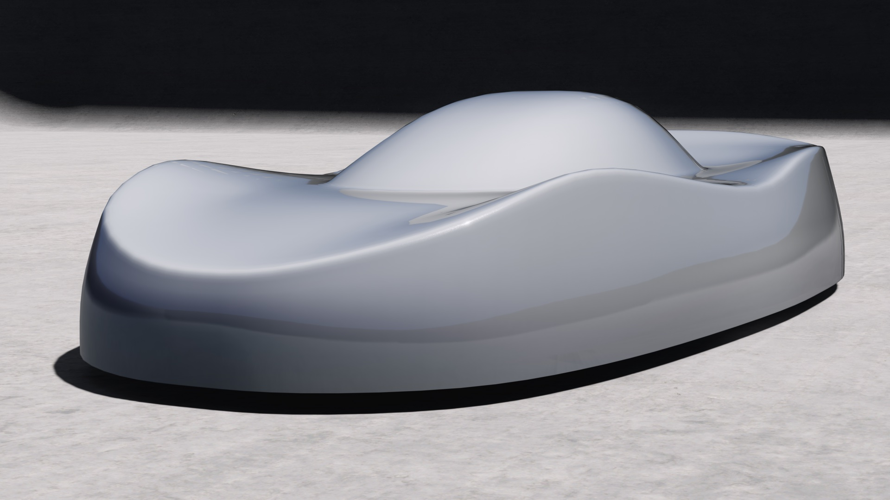


---

### 金属漆

**主要作用和表现：**

> 增强金属反射
> 
> 增加彩色高光
> 
> 适合现代量产车车漆

**样板代码：**

```ini
[Material_CarPaint_Metallic] ; 金属车漆模板
Materials = body_paint ; 作用车漆材质
BrightnessAdjustment = 0.9 ; 车漆整体亮度
ColoredSpecular = 0.9 ; 彩色高光强度
AmbientSpecular = 0.6 ; 环境高光强度
AmbientSpecularEXP = 2.5 ; 环境高光集中度
ClearCoatThickness = 0.06 ; 清漆层厚度
FresnelMax = 1.0 ; 边缘最大反射
FresnelC = 0.1 ; 正面基础反射
```

**游戏内效果：**

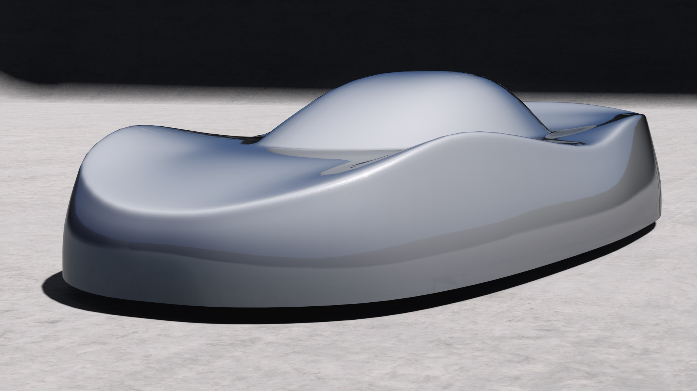


---

### 高金属漆

**主要作用和表现：**

> 金色 / 银色 / 有色金属车漆
> 
> 反射受车漆颜色影响

**样板代码：**

```ini
[Material_CarPaint_Metal] ; 高金属车漆模板
Materials = body_paint_metal ; 作用高金属车漆材质
UseMetallicReflections = 1 ; 启用有色金属反射
FresnelMax = 1.0 ; 边缘最大反射
FresnelC = 1.0 ; 正面基础反射
FlakesK = 1.0 ; 金属颗粒强度
ClearCoatThickness = 0.2 ; 清漆层厚度
ColoredSpecular = 1.0 ; 彩色高光强度
AmbientSpecular = 0.5 ; 环境高光强度
BrightnessAdjustment = 0.2 ; 压低整体亮度
```

**游戏内效果：**

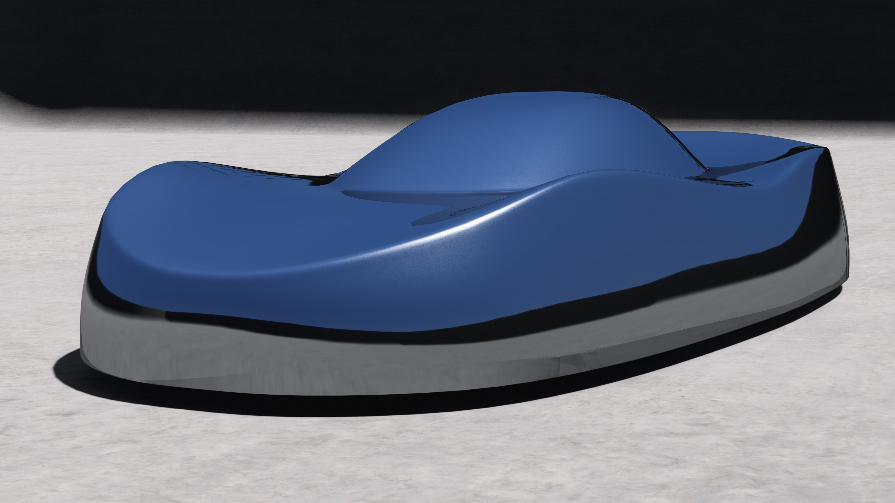


---

### 镀铬车漆

**主要作用和表现：**

> 高反射车漆
> 
> 适合镀铬外观
> 
> 适合镜面改装件

**样板代码：**

```ini
[Material_CarPaint_Chrome] ; 镀铬车漆模板
Materials = body_chrome ; 作用镀铬车漆材质
BrightnessAdjustment = 0.5 ; 降低整体亮度
ColoredSpecular = 0.9 ; 彩色高光强度
AmbientSpecular = 0.0 ; 环境高光强度
AmbientSpecularEXP = 2.5 ; 环境高光集中度
ClearCoatThickness = 0.0 ; 清漆层厚度
FresnelMax = 1.0 ; 边缘最大反射
FresnelC = 0.4 ; 正面基础反射
```

**游戏内效果：**

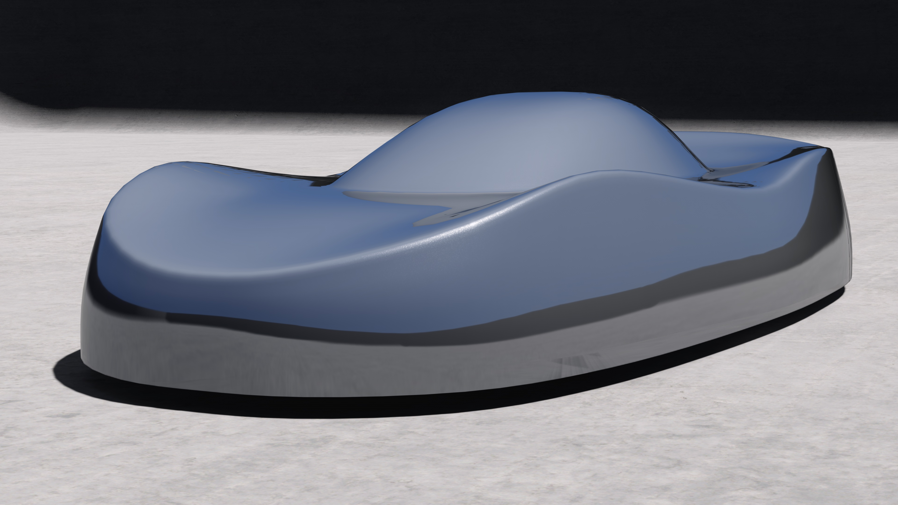


---

### 哑光漆

**主要作用和表现：**

> 降低镜面反射
> 
> 扩散太阳高光
> 
> 适合磨砂漆 / 哑光膜

**样板代码：**

```ini
[Material_CarPaint_Matte]
MATERIALS = body_paint_matte                     ; 作用材质名
UseMetallicReflections = 0.2              ; 金属反射强度
FresnelEXP = 6                           ; 菲涅尔指数（边缘高光衰减）
FresnelMax = 0.6                         ; 菲涅尔最大值
FresnelC = 0.02                          ; 菲涅尔基础反射
FlakesK = 0.2                            ; 金属颗粒强度（0为关闭）
BrightnessAdjustment = 0.65              ; 整体亮度调整
ClearCoatSpecular = 1                    ; 清漆层高光强度
ClearCoatThickness = 0.65                ; 清漆层厚度
ClearCoatIOR = 1.10                      ; 清漆层折射率
ColoredSpecular = 1                      ; 高光带颜色
PearlescentSpecular = 1.5                ; 珠光高光强度
SpecularBase = 0.7, 25                   ; 基础高光（强度, 粗糙度）
SpecularSun = 0.0, 10000                 ; 太阳高光（强度, 指数）
AmbientSpecular = 0.5                    ; 环境高光强度
AmbientSpecularEXP = 2                   ; 环境高光指数
SecondaryReflection = 1                  ; 次级反射开关
PROP_... = detailUVMultiplier, 40        ; 细节贴图UV缩放倍数
PROP_... = isAdditive, 0                 ; 是否叠加模式（0关闭）
```

**游戏内效果：**

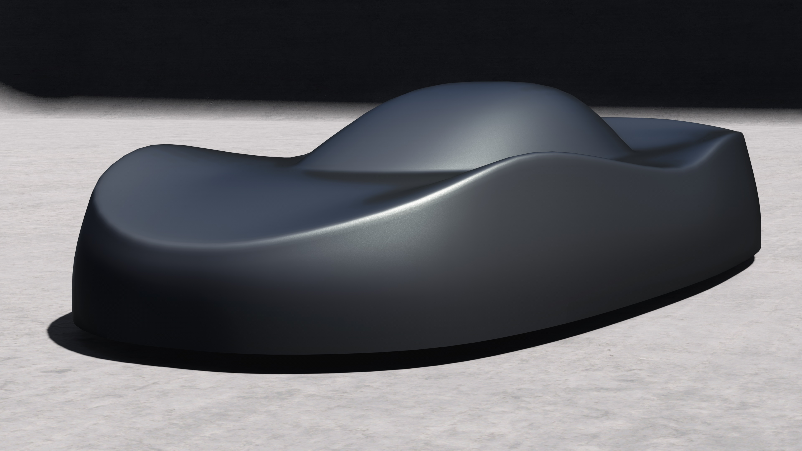


---

### 珠光漆

**主要作用和表现：**

> 增加珠光高光
> 
> 适合白色珠光 / 高级定制漆

**样板代码：**

```ini
[Material_CarPaint_Pearl] ; 珠光车漆模板
Materials = body_paint ; 作用车漆材质
BrightnessAdjustment = 0.9 ; 车漆整体亮度
PearlescentSpecular = 1.0 ; 珠光高光强度
AmbientSpecular = 1.0 ; 环境高光强度
AmbientSpecularEXP = 3.0 ; 环境高光集中度
ClearCoatThickness = 0.09 ; 清漆层厚度
FresnelMax = 1.0 ; 边缘最大反射
FresnelC = 0.1 ; 正面基础反射
SpecularBase = 1, 50 ; 基础高光强度与锐度
```

**游戏内效果：**

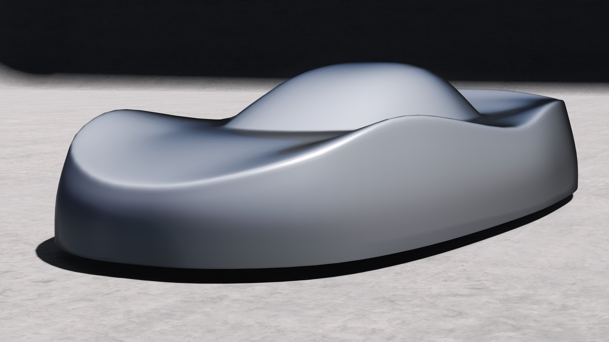


---

### 旧漆 / 橘皮漆

**主要作用和表现：**

> 增加表面噪波
> 
> 制造橘皮漆面
> 
> 适合老车 / 旧车漆

**样板代码：**

```ini
[Material_CarPaint_Old] ; 旧车漆 / 橘皮车漆效果
Materials = body_paint_old ; 需要应用的车漆材质名称
FresnelMax = 0.9                    ; 菲涅尔最大反射强度，控制掠射角反光上限
FresnelC = 0.05                     ; 菲涅尔基础反射值，影响正面观察时反光强度
FlakesK = 0                         ; 金属颗粒强度，0为关闭金属漆颗粒效果
SpecularSun = 0.5, 1000            ; 阳光高光强度,高光锐度（数值越大高光越集中）
SpecularBase = 0.5, 200              ; 环境高光强度,高光锐度（影响非太阳光源反射）
AmbientSpecular = 0.1              ; 环境镜面反射强度
BrightnessAdjustment = 0.55           ; 亮度补偿，防止环境高光导致整体偏亮
ColoredSpecular = 0                ; 是否启用彩色高光，0为白色高光
AmbientSpecular = 0.1              ; 环境镜面反射强度
AmbientSpecularEXP = 2             ; 环境高光衰减指数，数值越大过渡越柔和
ClearCoatThickness = 0.2           ; 清漆层厚度，模拟表层透明保护漆
ClearCoatIOR = 1.25                ; 清漆层折射率，影响反射和折射效果
UseMetallicReflections = 0.2       ; 金属反射参与度，控制环境反射强度
SHADER = ksPerPixelMultiMap_NMDetail ; 支持细节法线的车漆着色器
PROP_... = detailNormalBlend, 0.17 ; 细节法线混合强度
PROP_... = detailUVMultiplier, 180 ; 细节法线平铺密度
RESOURCE_1 = txNormalDetail ; 细节法线资源槽
RESOURCE_FILE_1 = orangepeelNM.dds ; 橘皮法线贴图文件
```

**游戏内效果：**

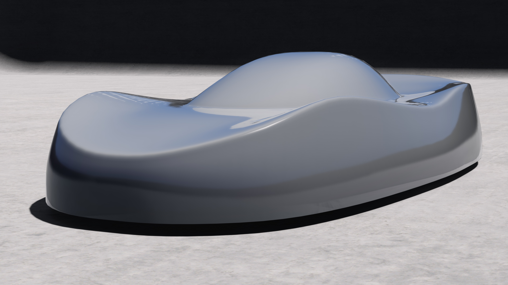

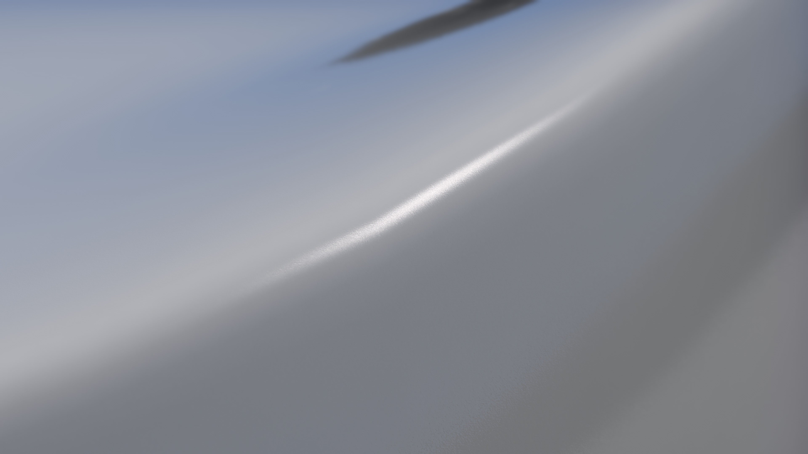

**橘皮漆法线贴图：**

<figure view-type="Card"><source name="orangepeelNM.dds" href="https://internal-api-drive-stream.feishu.cn/space/api/box/stream/download/authcode/?code=ZDY2YTM2NjQ5OWRhOTk4OTIxNjljNmM1OTVkNjkxMDdfYzNkOTE1YzQyNmQ4YjA5ZjhkMTgyNThhZDM4MmJjYzRfSUQ6NzY0NzA2NjgxMTkyNjgyNjE5NV8xNzg1ODE4MjIxOjE3ODU4MjE4MjFfVjM" mime="image/vnd.ms-dds" size="22000" token="F4L9bGyrJobap5xEQy2c1C8anQe"/></figure>


---

### 变色龙漆

**主要作用和表现：**

> 视角变化产生颜色变化
> 
> 适合彩虹膜 / 改色膜 / 变色喷漆

**样板代码：**

```ini
[Material_CarPaint_Chameleon] ; 变色龙车漆模板
Materials = body_paint_chameleon ; 作用变色车漆材质
BrightnessAdjustment = 1.0 ; 车漆整体亮度
ColoredSpecular = 1.0 ; 彩色高光强度
AmbientSpecular = 0.8 ; 环境高光强度
AmbientSpecularEXP = 3.0 ; 环境高光集中度
ClearCoatThickness = 0.1 ; 清漆层厚度
FresnelMax = 1.5 ; 边缘最大反射
FresnelC = 0.15 ; 正面基础反射
ChameleonColorA = #33007f, 0.5 ; 第一变色颜色与强度
ChameleonColorB = #ffff00, 1.0 ; 第二变色颜色与强度
ChameleonExponent = 1.2 ; 变色过渡强度
ChameleonCenter = 0.45 ; 变色中心位置
UseDiffuseAlphaAsChameleonMask = 0 ; 不使用 Diffuse Alpha 遮罩
```

**游戏内效果：**

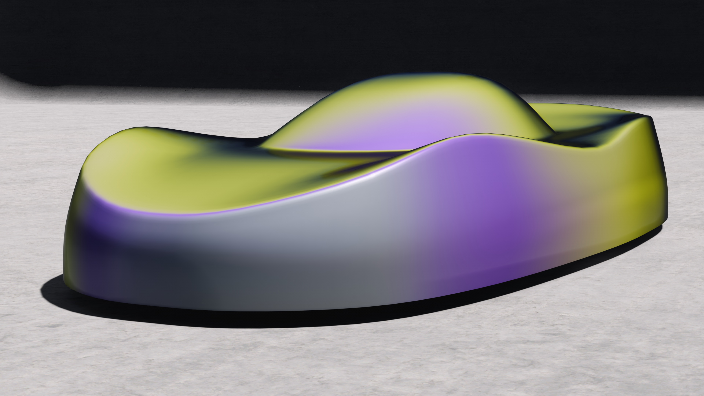


---

### 变色漆

**主要作用和表现：**

> 使用渐变贴图控制变色
> 
> 比 Chameleon 更适合复杂角度变色

**样板代码：**

```ini
[Material_CarPaint_ChromaFlair] ; ChromaFlair 变色车漆模板
Materials = body_paint_chromaflair ; 作用变色车漆材质
CarPaintVersionAware = 4 ; 使用新版车漆系统
GradientTexture = extension/textures/body/chromaflair_gradient.dds ; 变色渐变贴图
ChromaFlairFlakesBase = 0.5 ; 颗粒基础反射强度
ApplyTilingFix = 1 ; 启用平铺修正
ClearCoatReflectionSharpness = 1 ; 清漆反射清晰度
ColoredSpecular = 1 ; 彩色高光强度
PearlescentSpecular = 0 ; 关闭珠光高光
SpecularBase = 2, 20 ; 基础高光强度与锐度
UseDiffuseAlphaAsChromaFlairMask = 0 ; 不使用 Diffuse Alpha 遮罩
```

**游戏内效果：**

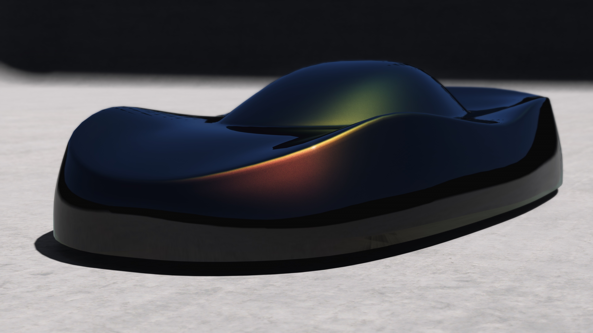

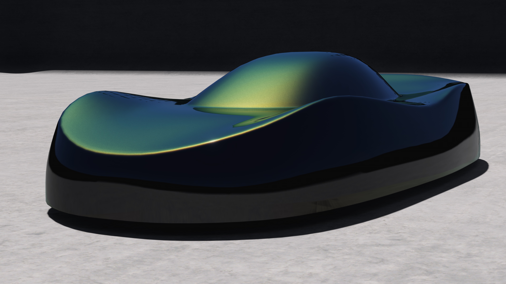

**测试使用的贴图：**

<figure view-type="Card"><source name="chromaflair_gradient.dds" href="https://internal-api-drive-stream.feishu.cn/space/api/box/stream/download/authcode/?code=NzQ5NmYzYzRjMjZiN2E5ODAwMmJmZjRjYmM3NmJkODhfNmZkNjc3MzhhNWE4NWI4YTZlMGY4YWFmNmEyYmZiOTRfSUQ6NzY0NzA3NTQ4MjAzMDYyMzcxNF8xNzg1ODE4MjIxOjE3ODU4MjE4MjFfVjM" mime="image/vnd.ms-dds" size="2104512" token="KwaKbFoKkowBbtx1KZPcSHDwnCf"/></figure>


---

### 彩虹镀铬漆

**主要作用和表现：**

> 彩虹镀铬反射
> 
> 偏实验效果
> 
> 适合展示车 / 改装膜

**样板代码：**

```ini
[Material_CarPaint_RainbowChrome] ; 彩虹镀铬车漆模板
Materials = body_paint_rainbow_chrome ; 作用彩虹镀铬材质
ChromeRainbowFlip = 0 ; 不翻转彩虹方向
ChromeRainbowNegate = 1 ; 反向彩虹颜色
ChromeRainbowFocus = 1 ; 彩虹集中度
ChromeRainbowMult = 1 ; 彩虹强度
ChameleonColorA = 0, 0 ; 关闭第一变色
ChameleonColorB = 0, 0 ; 关闭第二变色
ChameleonExponent = 1 ; 变色指数
ChameleonCenter = 0.5 ; 变色中心
UseDiffuseAlphaAsRainbowMask = 0 ; 不使用 Diffuse Alpha 遮罩
```

**游戏内效果：**

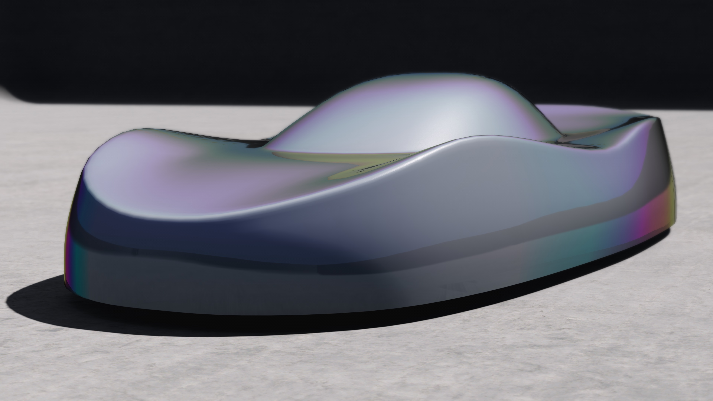


---

### 彩虹各向异性漆

**主要作用和表现：**

> 彩虹高光
> 
> 各向异性反射
> 
> 适合特殊贴膜 / 炫彩膜

**样板代码：**

```ini
[Material_CarPaint_Rainbow] ; 彩虹各向异性车漆模板
Materials = body_paint_rainbow ; 作用彩虹车漆材质
ChromeRainbowFlip = 0 ; 不翻转彩虹方向
ChromeRainbowNegate = 0 ; 不反向彩虹颜色
RainbowIntensity = 0.7 ; 彩虹强度
AnisotropicIntensity = 0.0 ; 各向异性白色高光强度
AnisotropicAmount = 0.9 ; 各向异性程度
Gloss = 0.7 ; 光泽度
BrightnessAdjustment = 0.8 ; 整体亮度修正
ChameleonColorA = 0, 0 ; 关闭第一变色
ChameleonColorB = 0, 0 ; 关闭第二变色
UseDiffuseAlphaAsRainbowMask = 0 ; 不使用 Diffuse Alpha 遮罩
```

**游戏内效果：**

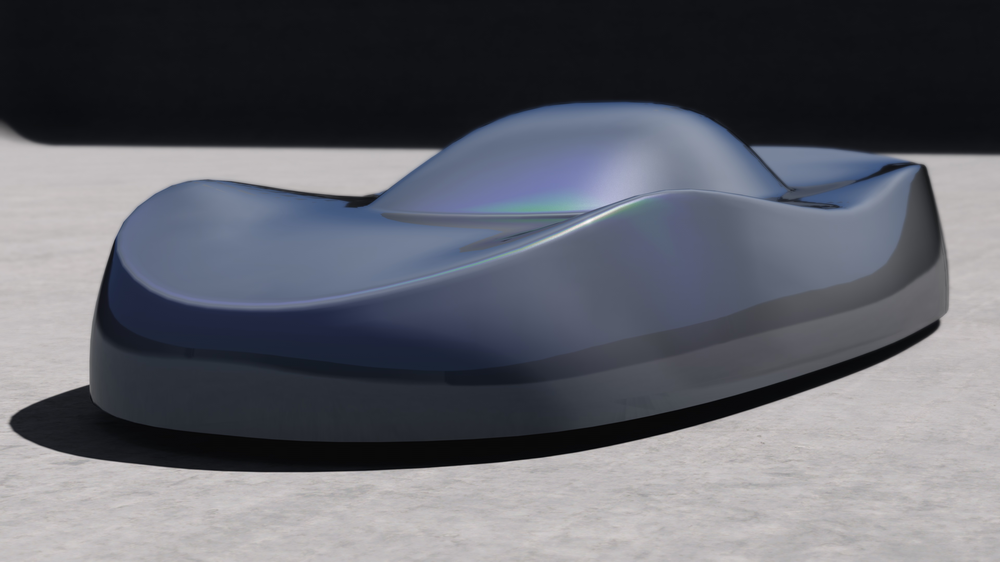

---

### 自定义闪粉颜色

```ini
[Material_CarPaint_Metallic] ; 金属车漆材质样板
Materials = Carpaint ; 需要套用的车漆材质名，必须和KN5里的材质名一致
FlakesK = 0.05 ; 闪粉强度，数值越大颗粒越明显
BaseSpecularColor = 1.0, 0.63, 0.12 ; 闪粉高光颜色，这里是金色偏橙
ColoredSpecular = 1.0 ; 启用有色高光，让高光受颜色影响
PearlescentSpecular = 0.0 ; 珍珠光强度，0为关闭珍珠光效果
UseMetallicReflections = 0.0 ; 金属反射参与度，0为关闭额外金属反射
ClearCoatTint = 0, 0, 0 ; 清漆染色，0为不染色
ClearCoatThickness = 0.08 ; 清漆层厚度，数值越大表层反光越明显
FresnelMax = 0.8 ; 侧面反射强度，数值越大斜角越亮
FresnelC = 0.08 ; 正面基础反射，数值越大正面越亮
SpecularBase = 0.35, 80 ; 基础高光强度和锐度，影响环境下的高光
SpecularSun = 2.2, 6000 ; 太阳高光强度和锐度，第二个数越大高光越尖锐
AmbientSpecular = 0.15 ; 环境高光强度，过高会让车漆发灰发亮
AmbientSpecularEXP = 3.0 ; 环境高光锐度，数值越大反光越集中
BrightnessAdjustment = 0.5 ; 车漆亮度补偿，数值越低整体越暗
ApplyTilingFix = 1 ; 开启平铺修正，减少纹理重复问题
```

---

## ② 玻璃材质

::: tip 🥃
CSP 官方 `materials_glass.ini` 包含 `Material_Glass`、`Material_GlassSide`、`Material_MultiEmissiveGlass`、`Material_PhotoelasticGlass` 模板。  
核心参数包括 `IOR`、`FilmIOR`、`ThicknessMult`、`ProfileFix`、`Refraction`、`RefractionBias`、`MaskPass`、`UseNormalMap` 等。
:::

### 普通玻璃

**主要作用和表现：**

> 车窗玻璃
> 
> 灯罩玻璃
> 
> 普通透明材质

**样板代码：**

```ini
[Material_Glass] ; CSP 普通玻璃模板
Materials = glass_front, glass_side, glass_rear ; 作用玻璃材质
IOR = 1.5 ; 玻璃折射率
FilmIOR = 1.5 ; 表层反射折射率
ThicknessMult = 1.0 ; 玻璃厚度倍率
ProfileFix = 0.04 ; 边缘厚度修正
BrightnessAdjustment = 1.0 ; 玻璃亮度修正
ExtraLightsAdjustment = 0.03 ; 额外灯光影响
Refraction = 0 ; 关闭折射
RefractionBias = 0 ; 关闭折射模糊
MaskPass = 0 ; 关闭遮罩层
Desaturate = 0 ; 不降低饱和度
```

**游戏内效果：**

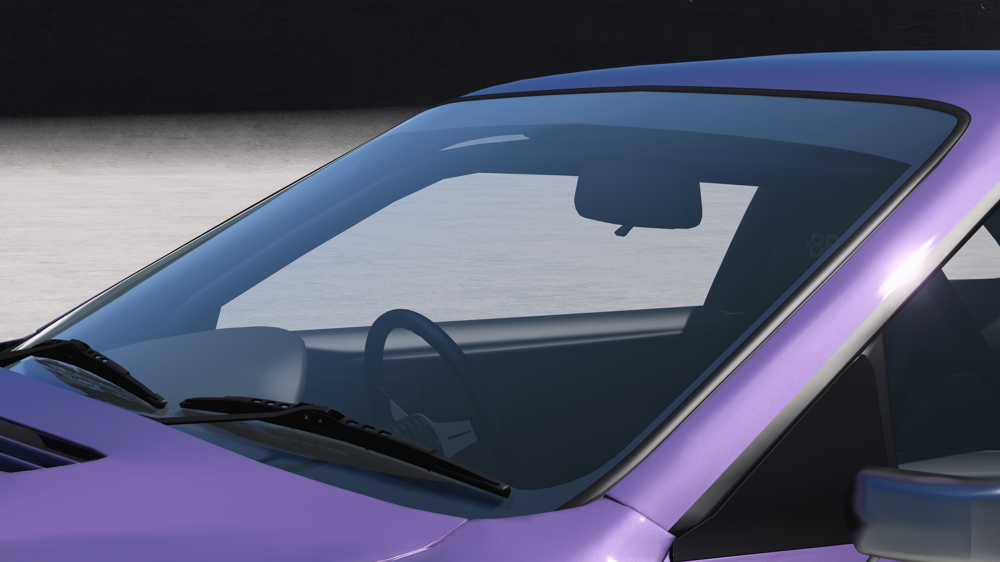

---

### 侧面折射玻璃

**样板代码：**

```ini
[Material_GlassSide] ; CSP 侧窗折射玻璃模板
Materials = glass_side ; 作用侧窗玻璃
ThicknessMult = 0 ; 降低玻璃厚度
BrightnessAdjustment = 1 ; 玻璃亮度修正
ExtraLightsAdjustment = 2 ; 提高额外灯光响应
Refraction = 1 ; 启用强折射
RefractionBias = 1 ; 启用折射模糊
```

**游戏内效果：**

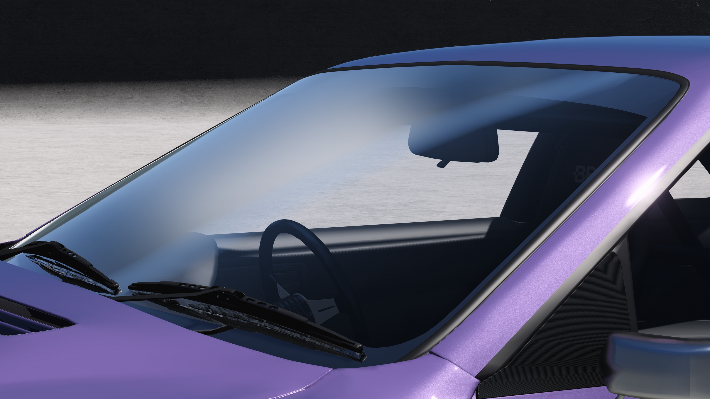

---

### 光弹玻璃

**样板代码：**

```ini
[Material_PhotoelasticGlass] ; 光弹 / 彩色应力玻璃模板
Materials = glass_front ; 作用前挡玻璃
FilmIOR = 3.2 ; 表层反射折射率
PhotoelasticityMult = 0.5 ; 光弹效果强度
ProfileFix = 0.08 ; 边缘厚度修正
PhotoelasticityBaseScale = 8 ; 基础纹理缩放
PhotoelasticityNoiseScale = 0.04 ; 噪波随机强度
PhotoelasticitySpotsScale = 0.5 ; 斑点范围
PhotoelasticitySpotsOffset = 0.1 ; 斑点偏移
PhotoelasticityStripesScale = 4 ; 条纹数量
```

**游戏内效果：**

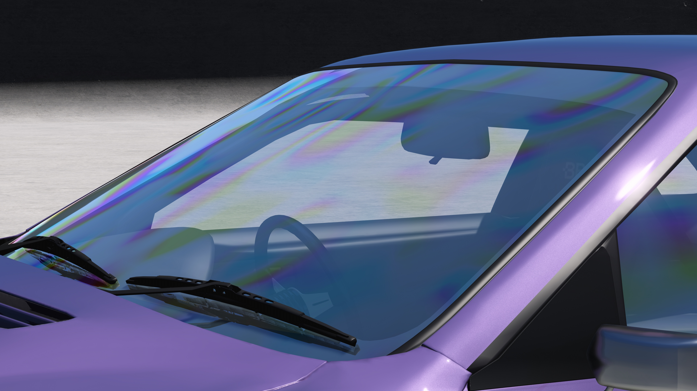

---

### 多通道发光玻璃

**样板代码：**

```ini
[Material_MultiEmissiveGlass] ; 多通道发光玻璃模板
Materials = taillight_glass ; 作用尾灯灯罩
IOR = 1.5 ; 玻璃折射率
FilmIOR = 2.2 ; 表层反射折射率
ThicknessMult = 0.5 ; 灯罩厚度倍率
Refraction = 0.1 ; 轻微折射
ExtraLightsAdjustment = 0.1 ; 额外灯光影响
```

> （无明显表现，效果自行尝试）

---

## ③ 内饰 PBR 材质

::: tip 💺
CSP 官方 `materials_interior.ini` 包含内饰屏幕、风挡横幅、毛绒材质，以及 PBR 内饰模板；  
其中 `Material_Plastic_v2`、`Leather_v2`、`Fabric_v2`、`Carpet_v2`、`Velvet_v2`、`Aluminium_v2`、`Metal_v2`、`Carbon` 等模板都在官方公共库内。
:::

### 塑料

**样板代码：**

```ini
[Material_Plastic_v2] ; CSP PBR 塑料模板
Materials = plastic_black, trim_black ; 作用塑料材质
Reflectance = 0.08 ; 反射率
Brightness = 0.5 ; 材质亮度
DetailScale = 50 ; 细节纹理缩放
DetailNormalBlend = 0.3 ; 细节法线混合强度
DetailTextureBlur = 1 ; 模糊细节颜色
```

**游戏内效果:**

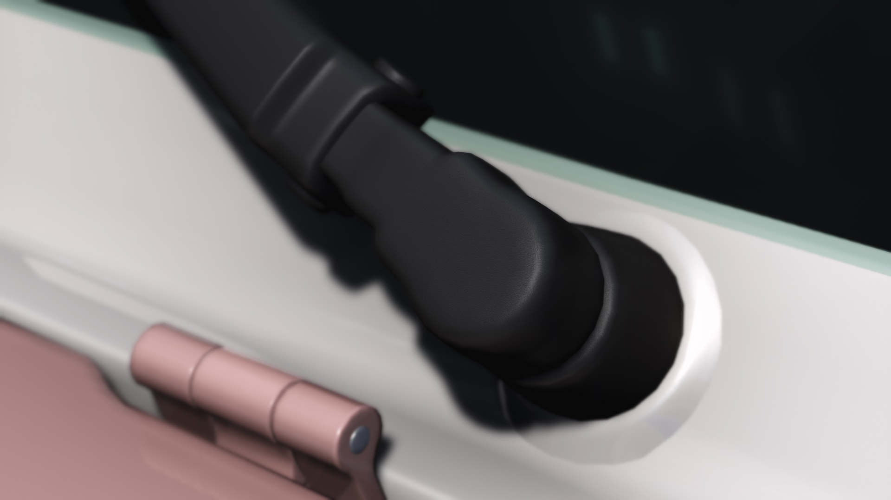

#### 橡胶/胶条

```ini
[Material_Plastic_v2] ; 胶圈橡胶
Materials=rubber                ; 材质名
Reflectance=0.01                        ; 反射率
Brightness=0.52                          ; 亮度
Smoothness=0.08                          ; 光滑度
DetailScale=200                           ; 纹理缩放
DetailNormalBlend=0.55                    ; 法线强度
DetailTextureBlur=1                        ; 细节模糊
DetailNormalTexture=rubber_norm.dds ; 自定义法线
DetailNormalPBRSecondaryColor=0,0,0,0.45  ; 二次颜色
DetailNormalPBRSmoothnessGamma=0.8       ; 光滑度修正
AmbientSpecular=0.02                      ; 环境高光
AmbientSpecularEXP=1                      ; 高光指数
CubemapReflectionBlur=1                   ; 环境反射模糊
LocalReflectionsSharpness=0               ; 局部反射锐度
```

**游戏内效果:**

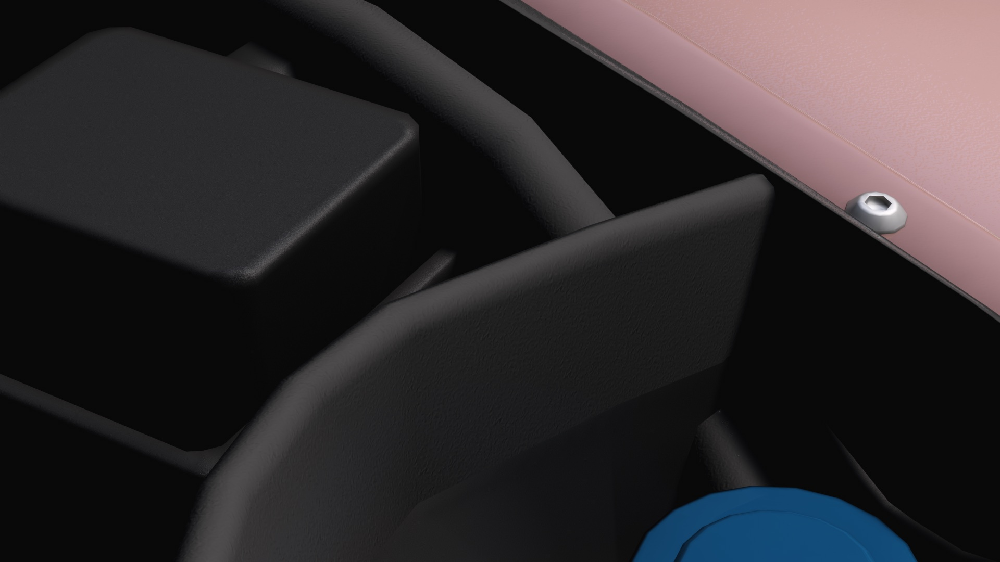

---


### 皮革

**样板代码：**

```ini
[Material_Leather_v2] ; CSP PBR 皮革模板
Materials = leather_seat, leather_dashboard ; 作用皮革材质
Reflectance = 0.02 ; 皮革反射率
Brightness = 0.45 ; 皮革亮度
DetailScale = 90 ; 皮革纹理缩放
DetailNormalIntensity = 1 ; 皮革法线强度
DetailNormalBlend = -1 ; 皮革法线混合
```

**游戏内效果:**

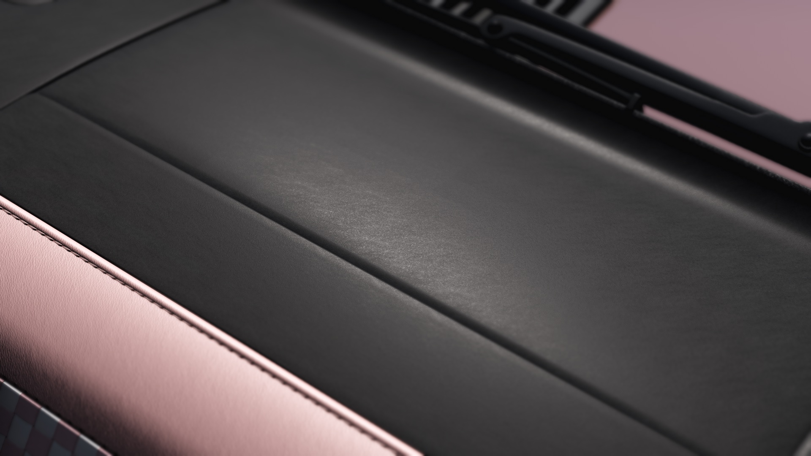


---

### 旧版皮革

**样板代码：**

```ini
[Material_Leather] ; 旧版皮革材质
Materials = material_black_leather ; 作用皮革材质
BrightnessAdjustment = 0.03 ; 亮度修正
DetailTextureBlur = 0.0 ; 细节纹理模糊
DetailNormalBlend = 0.75 ; 细节法线混合
DetailScale = 60 ; 皮革纹理缩放
Reflectance = 0.08 ; 反射率
Smoothness = 0.45 ; 表面光滑度
ApplyTilingFix = 0 ; 启用平铺修正
```

**游戏内效果:**

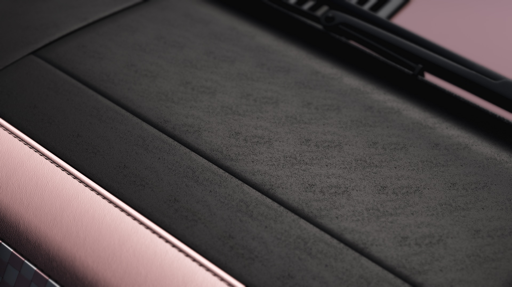


---

### 斑点皮革

**样板代码：**

```ini
[Material_LeatherSpotty_v2] ; CSP 斑点皮革模板
Materials = leather_spotty ; 作用斑点皮革材质
Reflectance = 0.03 ; 皮革反射率
Brightness = 0.45 ; 皮革亮度
DetailScale = 35 ; 皮革纹理缩放
DetailNormalIntensity = 2 ; 细节法线强度
```

**游戏内效果:**

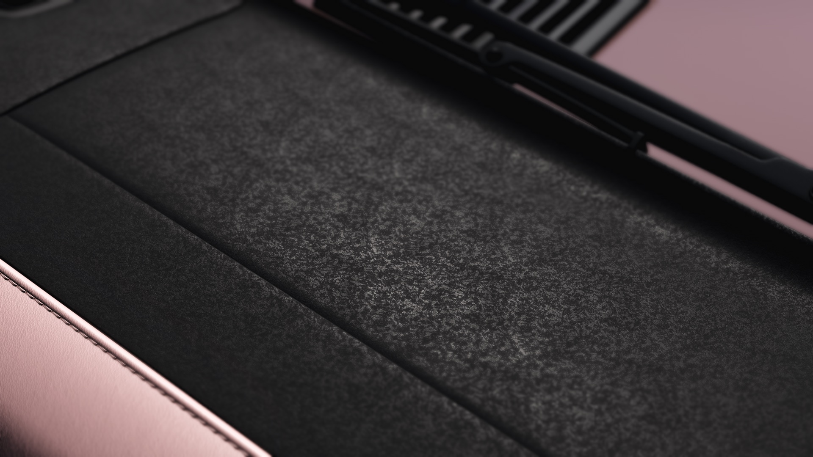


---

### 打孔皮革

**样板代码：**

```ini
[Material_LeatherPoked_v2] ; CSP 打孔皮革模板
Materials = leather_poked, seat_poked ; 作用打孔皮革材质
Reflectance = 0.04 ; 皮革反射率
Brightness = 0.45 ; 皮革亮度
DetailScale = 35 ; 打孔纹理缩放
DetailNormalIntensity = 2 ; 打孔法线强度
```

**游戏内效果:**

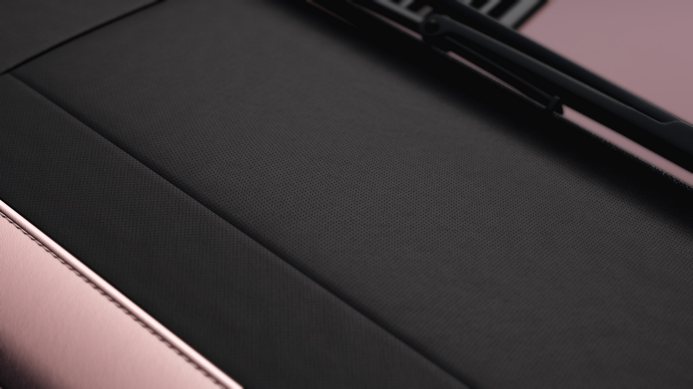


---

### 织物

**样板代码：**

```ini
[Material_Fabric_v2] ; CSP PBR 织物模板
Materials = fabric_seat, fabric_door ; 作用织物材质
Reflectance = 0.4 ; 布料边缘反射
Brightness = 0.35 ; 织物亮度
DetailScale = 25 ; 织物纹理缩放
UseClothShading = 1 ; 启用布料着色
ClothSheenColor = 1, 1, 1 ; 布料边缘光颜色
```

**游戏内效果:**

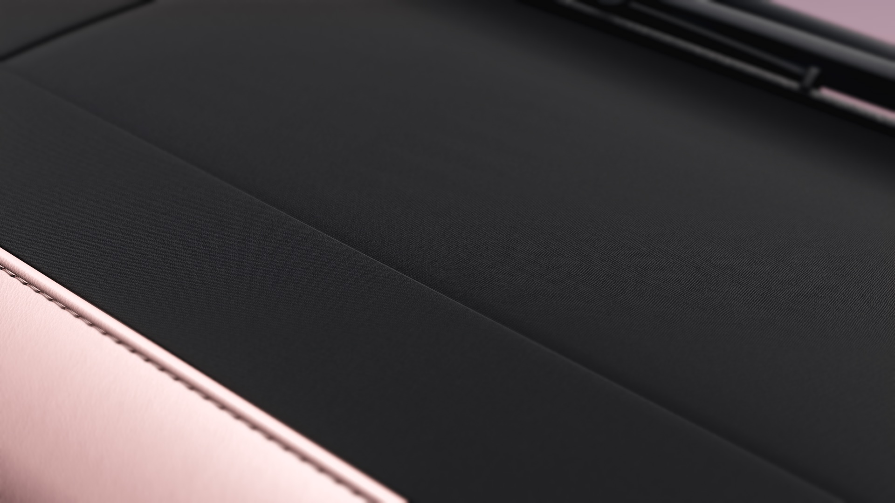


---

### 地毯

**样板代码：**

```ini
[Material_Carpet_v2] ; CSP PBR 地毯模板
Materials = carpet, floor_fabric ; 作用地毯材质
Reflectance = 0.04 ; 地毯反射率
Brightness = 0.28 ; 地毯亮度
DetailScale = 40 ; 地毯纹理缩放
DetailNormalBlend = -1 ; 地毯法线混合
```

**游戏内效果:**

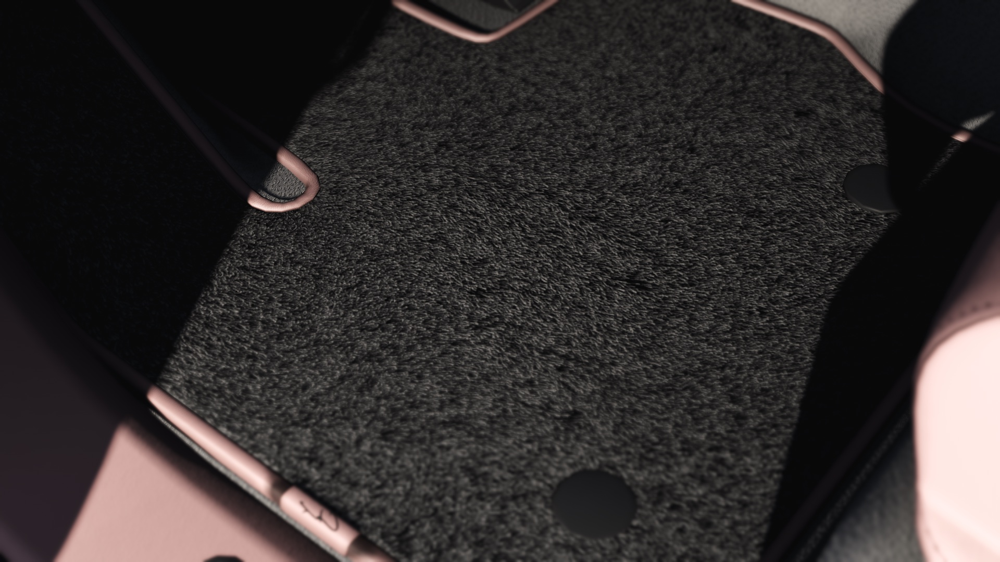


---

### 翻毛皮

**样板代码：**

```ini
[Material_Velvet_v2] ; CSP 翻毛皮模板
Materials = alcantara, suede ; 作用翻毛皮材质
Reflectance = 0.5 ; 边缘反射率
Brightness = 0.3 ; 翻毛皮亮度
DetailScale = 40 ; 纹理缩放
UseClothShading = 1 ; 启用布料着色
ClothSheenColor = 1, 1, 1 ; 边缘光颜色
```

**游戏内效果：**

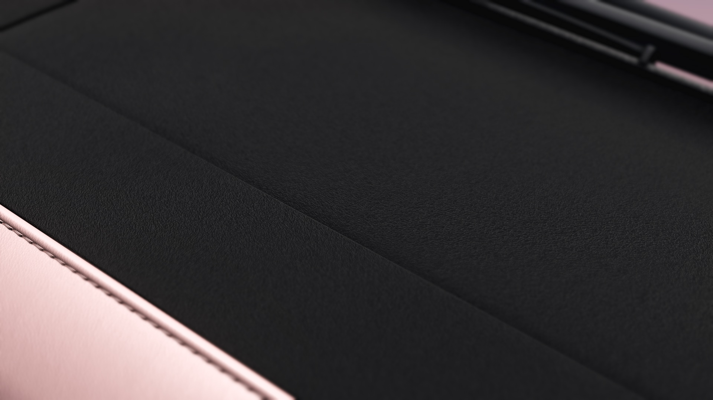


---

### 真实毛绒材质

`Material_Fur` 会多层渲染 Mesh，参数包括 `FurLayers`、`FurScale`、`FurGravityFactor`、`FurUseTextures`、`FurOcclusion` 等，官方文件提醒层数越高越消耗性能。

**样板代码：**

```ini
[Material_Fur] ; CSP 毛绒材质模板
Materials = carpet_fur, fabric_fur ; 作用毛绒材质
FurLayers = 6 ; 毛绒渲染层数
FurScale = 1 ; 毛绒深度
FurFacingScale = 0.5 ; 面向镜头时的深度缩减
FurGravityFactor = 1 ; 毛绒下垂强度
FurUseTextures = 0 ; 使用贴图 Alpha 控制毛绒
FurUseDetailAlpha = 0 ; 不使用 txDetail Alpha
FurFidelityScale = 5 ; 噪波精度
FurOcclusion = 0.5 ; 底层暗部强度
FurRimExponent = 3 ; 边缘光指数
FurAmbient = 1 ; 环境边缘光亮度
FurDiffuse = 1 ; 漫反射亮度
ThresholdExponent = 0.8 ; 毛绒阈值指数
ThresholdMultipler = 0.8 ; 毛绒阈值倍率
```

**游戏内效果:**


---

### 铝

**样板代码：**

```ini
[Material_Aluminium_v2] ; CSP 铝材质模板
Materials = aluminium, metal_trim ; 作用铝件材质
Metalness = 0.4 ; 金属度
Reflectance = 1.0 ; 反射率
BrightnessAdjustment = 0.5 ; 亮度修正
DetailTexture = 1 ; 启用细节贴图
DetailScale = 30 ; 金属纹理缩放
DetailNormalBlend = 1 ; 法线混合强度
```

**游戏内效果:**

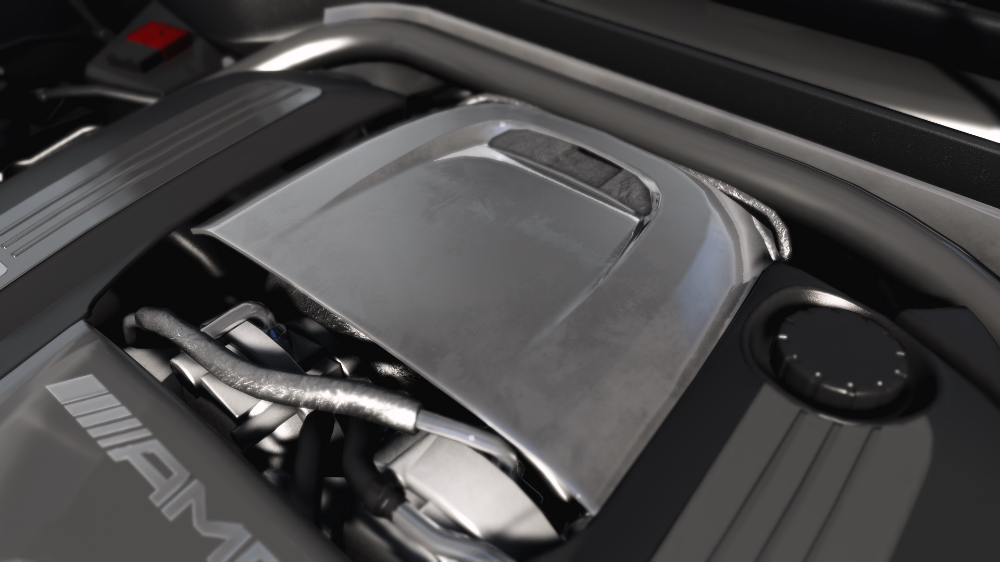


---

### 旧铝

**样板代码：**

```ini
[Material_AluminiumOld_v2] ; CSP 旧铝模板
Materials = aluminium_old, brushed_old ; 作用旧铝材质
Metalness = 0.2 ; 金属度
Reflectance = 0.2 ; 反射率
Brightness = 0.5 ; 亮度
DetailScale = 30 ; 纹理缩放
```

**游戏内效果:**

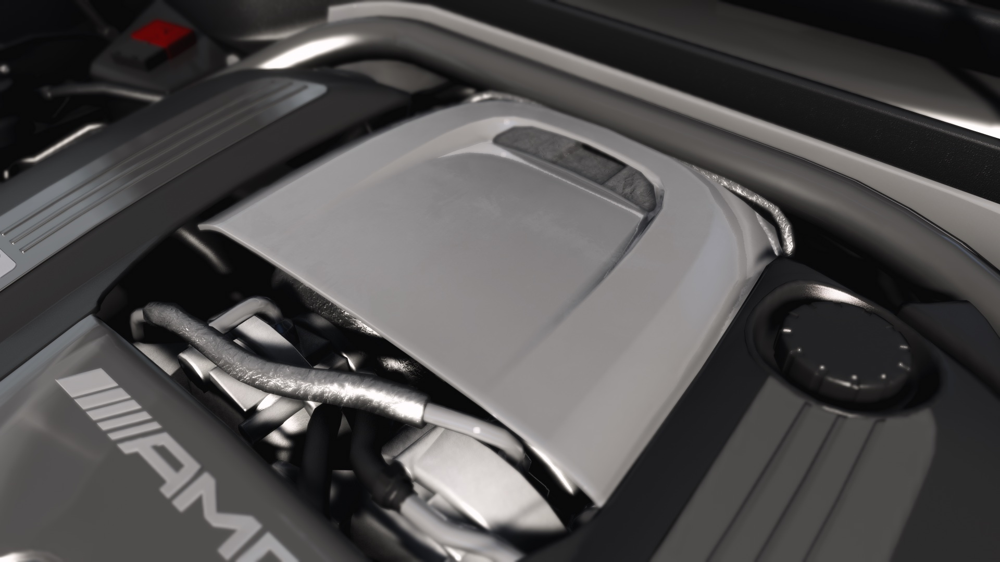


---

### 金属

**样板代码：**

```ini
[Material_Metal_v2] ; CSP 金属模板
Materials = metal_dark, metal_raw ; 作用金属材质
Metalness = 0.8 ; 金属度
Reflectance = 1.0 ; 反射率
BrightnessAdjustment = 0.8 ; 亮度修正
LocalReflectionsSharpness = 1 ; 本地反射清晰度
DetailScale = 30 ; 金属纹理缩放
```

**游戏内效果:**

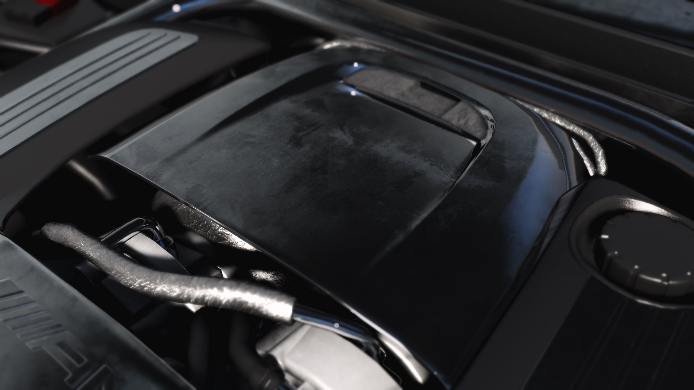


---

### 旧版金属

**样板代码：**

```ini
[Material_Metal] ; 旧版金属材质
Materials = matt; 作用旧版金属材质
Reflectance = 0.8 ; 反射强度
Smoothness = 0.9 ; 表面光滑度
DetailNormalBlend = 1 ; 细节法线混合
DetailScale = 15 ; 细节纹理缩放
BrightnessAdjustment = 0.9 ; 亮度修正
CubemapReflectionBlur = 1 ; 环境反射模糊
Metalness = 1 ; 金属度
```

**游戏内效果:**

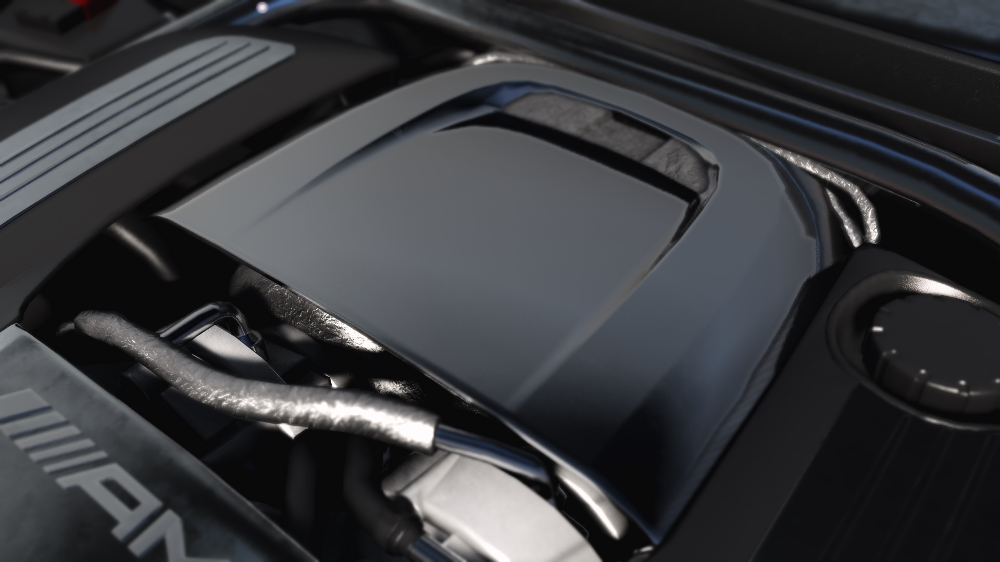


---

### 旧金属

**样板代码：**

```ini
[Material_MetalOld_v2] ; CSP 旧金属模板
Materials = metal_old, brake_disc ; 作用旧金属材质
Metalness = 0.8 ; 金属度
Reflectance = 0.0 ; 降低反射率
Brightness = 0.3 ; 降低亮度
LocalReflectionsSharpness = 0 ; 关闭锐利本地反射
DetailScale = 30 ; 旧金属纹理缩放
```

**游戏内效果:**

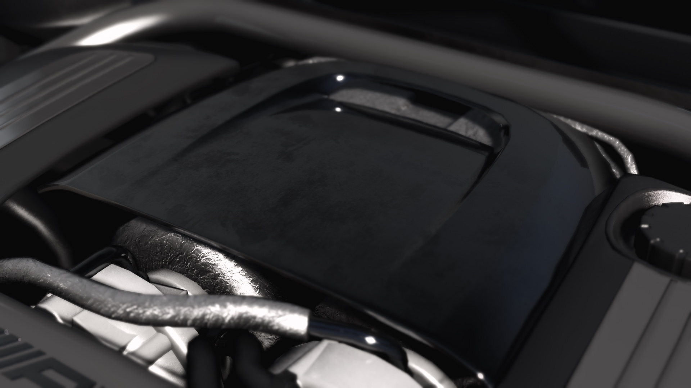


---

### 碳纤维

**样板代码：**

```ini
[Material_Carbon] ; CSP 碳纤维模板
Materials = carbon, carbon_interior ; 作用碳纤维材质
HasDetailNormals = 1 ; 启用细节法线
Smoothness = 0.9 ; 表面光滑度
Reflectance = 0.2 ; 反射率
CubemapReflectionBlur = 0.35 ; 环境反射模糊
UseClearCoat = 1 ; 启用清漆层
ClearCoatSmoothness = 1.0 ; 清漆光滑度
ClearCoatIntensity = 1.0 ; 清漆强度
DetailScale = 420 ; 碳纤维纹理缩放
```

**游戏内效果:**

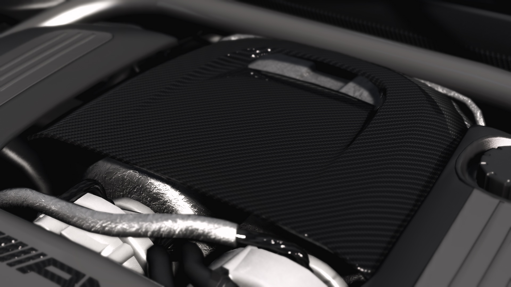


---

### 自定义颜色碳纤维

**样板代码：**

```ini
[Material_Carbon]  ;可自定义颜色碳纤维纹理
Meshes = carbon  ;使用碳纤维网格模型
DetailScale = 550  ;纹理细节缩放比例
Brightness = 0.8  ;整体亮度调节
ClearCoatF0 = 0.1  ;清漆层基础反射率
RESOURCE_0 = txDetail  ;纹理资源路径
RESOURCE_COLOR_0 = #B00000  ;主色调(红色)
DetailNormalPBRFormat = 1  ;使用PBR法线贴图格式
Smoothness = 0.0  ;表面光滑度
Metalness = 0.3  ;金属质感程度
Reflectance = 0.1  ;基础反射强度
```

**游戏内效果:**

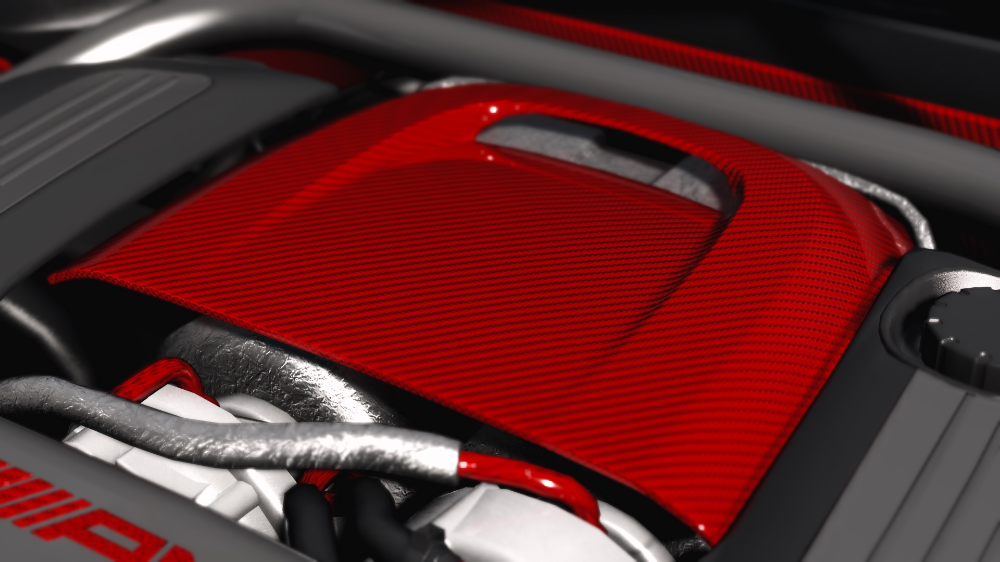


---

### 风挡横幅材质

`Material_WindscreenBanner` 支持透明遮罩、背景模糊、彩色阴影、雨滴排除和投影阈值等参数。

**样板代码：**

```ini
[Material_WindscreenBanner] ; CSP 风挡横幅模板
Materials = windscreen_banner ; 作用风挡横幅材质
WindscreenMesh = glass_front_inside ; 绑定内侧风挡 Mesh
BlurBackground = 0 ; 不模糊背景
RainDrops = 1 ; 保留雨滴效果
Brightness = 0.8 ; 横幅亮度
CastShadowsThreshold = 0.99 ; 投影透明阈值
MaskPass = 0.5 ; 遮罩层透明度
MaskPassColor = 0, 0, 0 ; 遮罩颜色
ColorfulShadowing = 2 ; 彩色阴影强度
```

**游戏内效果:**

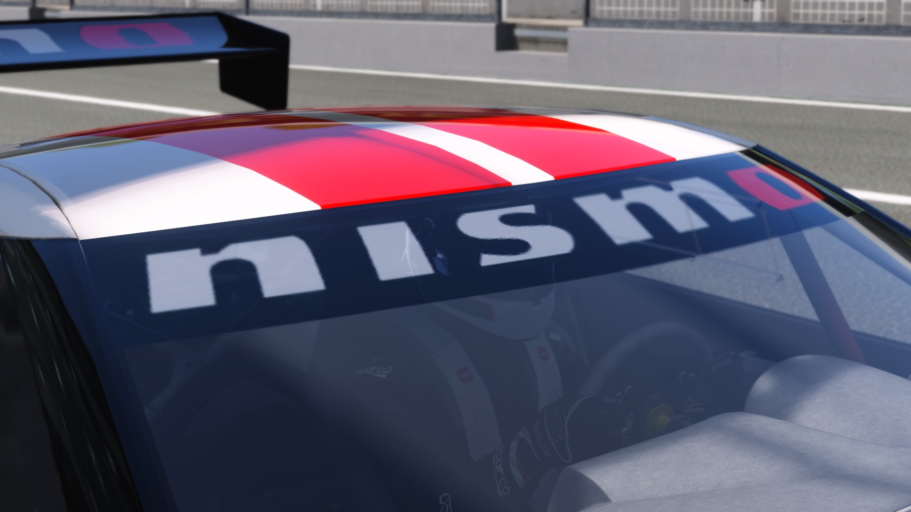


---

### 数字仪表屏材质

`官方 Material_DigitalScreen 支持 MatrixType = IPS / TN / VA、ScreenScale、ScreenAspectRatio、Emissive、FlipXY 等参数。`

**样板代码：**

```ini
[Material_DigitalScreen] ; CSP 数字屏幕模板
Materials = screen_dashboard ; 作用仪表屏材质
MatrixType = IPS ; 屏幕矩阵类型
UseTextureCoordinates = 1 ; 使用 UV 坐标
ScreenScale = 880 ; 横向像素密度
ScreenAspectRatio = 0.25 ; 屏幕高宽比
Emissive = 80 ; 屏幕发光强度
FlipXY = 0 ; 不旋转屏幕坐标
SkewTextureCoordinates = 0 ; 不倾斜 UV 坐标
TreatTextureAsHDR = 0 ; 普通贴图模式
```

```ini
[Material_DigitalScreen_...] ; 数字屏幕玻璃叠层模板
Materials = screen_glass ; 作用屏幕玻璃材质
MatrixType = IPS ; 屏幕矩阵类型
UseTextureCoordinates = 1 ; 使用 UV 坐标
ScreenScale = 880 ; 横向像素密度
ScreenAspectRatio = 0.25 ; 屏幕高宽比
FlipXY = 0 ; 不旋转屏幕坐标
```

**游戏内效果:**

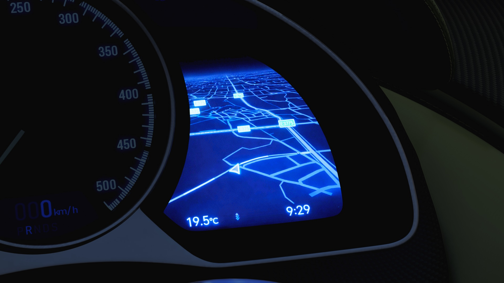

### 显示屏材质

```ini
[DisplayShape] ; 用四个点生成屏幕面
MeshName = __display_mesh ; 生成出来的屏幕模型名
Parent = COCKPIT_HR ; 挂到内饰父节点
P1 = -0.2, 0.8, 0.5 ; 左上角点
P2 = 0.2, 0.8, 0.5 ; 右上角点
P3 = 0.2, 0.6, 0.5 ; 右下角点
P4 = -0.2, 0.6, 0.5 ; 左下角点
ScreenScale = 256 ; 屏幕像素密度
MatrixType = TN ; 屏幕面板类型
ScreenAspectRatio = 1 ; 屏幕比例
Emissive = 4 ; 屏幕亮度
```

---

## ④ 通用材质

### 车牌材质

```ini
[Material_LicensePlate_Europe] ; 欧洲比例车牌，宽高约4:1
MATERIALS = cta412 ; 车牌材质名
TextureRatio = 4 ; 车牌宽高比
LettersDarkening = 0.85 ; 字母压暗强度
LettersSpecularDarkening = 0.5 ; 字母高光压暗
BounceBackBrightness = 0.5 ; 牌照灯回弹亮度
Depth = 1 ; 字母和边框凸起深度
ExtrudeLetters = 1 ; 启用字母凸起
```

```ini
[Material_LicensePlate_Japan] ; 日本比例车牌，宽高约2:1
MATERIALS = cta412 ; 车牌材质名
TextureRatio = 2 ; 车牌宽高比
LettersDarkening = 0.6 ; 字母压暗强度
BounceBackBrightness = 0.5 ; 灯光回弹亮度
Depth = 1 ; 凸起深度
LightLayout = AT_TOP ; 牌照灯来自上方
```

### 高反射材质

**样板代码：**

```ini
[Material_InteriorPBR] ; 通用 PBR 高反射材质
Materials = material_reflective_foil ; 作用材质名
BrightnessAdjustment = 0.95 ; 亮度修正
Reflectance = 0.99 ; 反射率
DetailScale = 10 ; 细节纹理缩放
CubemapReflectionBlur = 0.99 ; 环境反射模糊
Smoothness = 0.99 ; 表面光滑度
HasDetailNormals = 0 ; 启用细节法线
```

**游戏内效果:**

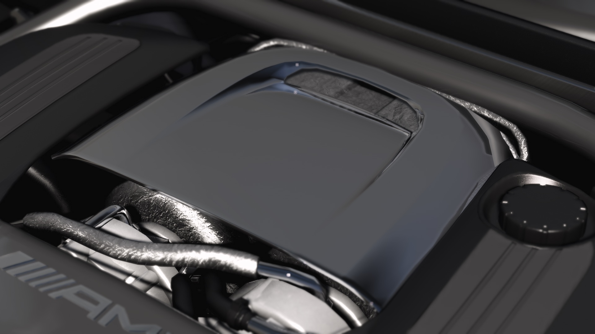


---

### 镀铬和金属

**样板代码：**

```ini
[Material_Chrome] ; 镀铬金属材质
Materials = material_chrome_trim ; 作用材质名
Smoothness = 0.999 ; 表面光滑度
Metalness = 0.9 ; 金属度
Reflectance = 0.9 ; 反射率
BrightnessAdjustment = 0.38 ; 亮度修正
OcclusionMap = 0.4, 1.0 ; AO 遮蔽范围
CubemapReflectionBlur = 0.3 ; 环境反射模糊
```

**游戏内效果:**

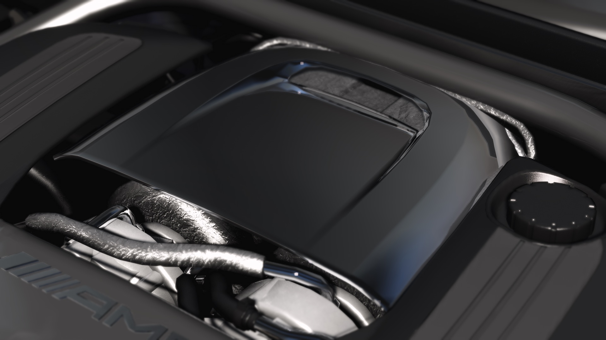

### 其他：人体表面材质

```ini
[INCLUDE: common/human_surface_template.ini] ; 引用人体表面模板
 
[SHADER_REPLACEMENT_0] ; 人体表面材质替换
MATERIALS = mesh ; 人体/皮肤材质名
FILL_MISSING_TEXTURES = 1 ; 补齐缺失贴图
; 普通车辆外观件一般不使用这个文件。
```

---

## ⑤ 材质覆盖与着色器替换

::: tip ⚽
参考：[Ereebay / acc-extension-config Wiki《General – Shader replacements》。](https://github.com/Ereebay/acc-extension-config/wiki/%E9%80%9A%E7%94%A8-%E2%80%93-%E7%9D%80%E8%89%B2%E5%99%A8%E6%9B%BF%E6%8D%A2)  
主要说明`[SHADER_REPLACEMENT_...]` 用于修改已有材质的 Shader、参数、贴图、透明模式、阴影和显示距离。适合静态材质修改，例如车漆、玻璃、树叶、草地、发光材质、远景物体等
:::

### 基础模板

```ini
[SHADER_REPLACEMENT_...] ; 着色器替换配置
ACTIVE=1 ; 启用配置
SKINS=red? ; 限定 Skin 生效，仅车辆可用
MATERIALS=body_paint ; 匹配材质，可写 body_paint、glass*、texture:grass?.dds
MESHES=body_mesh ; 匹配 Mesh，可写 mesh_bush_?，通常用于限制作用范围
SHADER=ksPerPixelMultiMap ; 指定 Shader
SHADER_OVERRIDE_0=ksTree, ksGrass ; 原 Shader 为 ksTree 时改用 ksGrass
PROP_0=ksAmbient, 0.4 ; 环境光强度
PROP_1=ksDiffuse, 0.5 ; 漫反射强度
PROP_2=ksSpecularEXP, 120 ; 高光锐度
PROP_3=ksEmissive, 1,0,0 ; 自发光颜色
RESOURCE_0=txDiffuse ; 漫反射贴图槽
RESOURCE_FILE_0=body.dds ; 调用外部贴图，默认在配置文件旁边
RESOURCE_1=txNormal ; 法线贴图槽
RESOURCE_REF_1=txDetailNM ; 引用原材质其它贴图槽
RESOURCE_2=txMaps ; Maps 贴图槽
RESOURCE_COLOR_2=1,1,1 ; 创建纯色贴图
FILL_MISSING_TEXTURES=1 ; 自动补齐缺失贴图
FORCE_POINT_SAMPLER=1 ; 强制像素采样，适合小贴图保持锐利
BLEND_MODE=OPAQUE ; 混合模式，OPAQUE 不透明，ALPHA_BLEND 半透明，ADD 加法发光
CULL_MODE=FRONT ; 剔除模式，FRONT 单面显示，OFF 双面显示
DEPTH_MODE=NORMAL ; 深度模式，控制遮挡关系
CAST_SHADOWS=1 ; 投射阴影，TERRAIN 为低太阳角度投射
SEMITRANSPARENT_SHADOWS=TEXTURE ; 半透明阴影，按贴图计算
DOUBLE_FACE_SHADOW_BIASED=1 ; 双面偏移阴影，适合薄片模型
FIXED_EMISSIVE=1 ; 固定自发光亮度
IS_TRANSPARENT=1 ; 按透明物体排序渲染
LAYER=0 ; 渲染层级
LOD_IN=0 ; 开始显示距离，单位米
LOD_OUT=500 ; 结束显示距离，单位米
DISABLE_FAR_PLANE_CLIPPING=1 ; 禁用远平面裁切，适合远景物体
```

---

### 双面渲染

> **模型背面法向原本会透明不可见，使用该代码后可强制反面正常显示**

```ini
[SHADER_REPLACEMENT_...] ;双面渲染
ACTIVE = 1 ;启用这组代码

MESHES = 235, SM_Body_101.014 ;指定需要双面显示的模型
MATERIALS = mesh;指定需要双面显示的材质

CULL_MODE = DOUBLESIDED ;关闭背面剔除，模型正反两面都显示
DOUBLE_FACE_SHADOW_BIASED = 1 ;修复双面模型阴影错误和闪烁
```

---

### 常用配置

```ini
BLEND_MODE=OPAQUE ; 不透明，性能最好
BLEND_MODE=ALPHA_TEST ; 透明裁切，适合树叶草片
BLEND_MODE=ALPHA_BLEND ; 半透明，适合玻璃
BLEND_MODE=ADD ; 加法发光，适合发光区域
BLEND_MODE=MULTIPLY ; 乘法混合，特殊遮罩用途
```

```ini
CULL_MODE=FRONT ; 正常单面显示
CULL_MODE=BACK ; 显示背面
CULL_MODE=OFF ; 双面显示，适合树叶、草片、薄玻璃
```

```ini
DEPTH_MODE=NORMAL ; 正常深度
DEPTH_MODE=NOWRITE ; 不写入深度
DEPTH_MODE=OFF ; 关闭深度
DEPTH_MODE=NORMAL_FORCED ; 强制正常深度，常用于透明排序修正
```

---

#### 自定义颜色贴图

```ini
[SHADER_REPLACEMENT_...] ; 自定义颜色贴图
MATERIALS = material_name ; 需要替换颜色贴图的材质名
RESOURCE_0 = txDiffuse ; 指定颜色贴图槽
RESOURCE_FILE_0 = custom_diffuse.dds ; 使用外部颜色贴图文件
```

#### 自定义法线贴图

```ini
[SHADER_REPLACEMENT_...] ; 自定义基础法线贴图
MATERIALS = material_name ; 需要替换法线贴图的材质名
SHADER = ksPerPixelNM ; 使用支持法线的shader
RESOURCE_0 = txNormal ; 指定基础法线贴图槽
RESOURCE_FILE_0 = custom_normal.dds ; 使用外部法线贴图文件
FILL_MISSING_TEXTURES = 1 ; 自动补齐缺失贴图，避免材质显示异常
```

#### 自定义细节法线

```ini
[SHADER_REPLACEMENT_...] ; 自定义平铺细节法线
MATERIALS = material_name ; 需要添加细节法线的材质名
SHADER = ksPerPixelMultiMap_NMDetail ; 使用支持细节法线的shader
PROP_0 = detailNormalBlend, 0.15 ; 细节法线强度，越高纹理越明显
PROP_1 = detailUVMultiplier, 180 ; 细节法线平铺密度，越高纹理越密
RESOURCE_0 = txNormalDetail ; 指定细节法线贴图槽
RESOURCE_FILE_0 = custom_detail_normal.dds ; 使用外部细节法线贴图
FILL_MISSING_TEXTURES = 1 ; 自动补齐缺失贴图
```

#### 自定义Maps贴图

```ini
[SHADER_REPLACEMENT_...] ; 自定义PBR或Maps贴图
MATERIALS = material_name ; 需要替换Maps贴图的材质名
RESOURCE_0 = txMaps ; 指定Maps贴图槽
RESOURCE_FILE_0 = custom_maps.dds ; 使用外部Maps贴图文件
```

#### 自定义Detail颜色贴图

```ini
[SHADER_REPLACEMENT_...] ; 自定义细节颜色贴图
MATERIALS = material_name ; 需要添加细节颜色的材质名
SHADER = ksPerPixelMultiMap_NMDetail ; 使用支持Detail贴图的shader
PROP_0 = detailUVMultiplier, 120 ; Detail贴图平铺密度
RESOURCE_0 = txDetail ; 指定Detail颜色贴图槽
RESOURCE_FILE_0 = custom_detail.dds ; 使用外部Detail颜色贴图
```

#### 自定义遮罩贴图

```ini
[SHADER_REPLACEMENT_...] ; 自定义遮罩贴图
MATERIALS = material_name ; 需要替换遮罩的材质名
RESOURCE_0 = txMask ; 指定遮罩贴图槽，是否生效取决于当前shader
RESOURCE_FILE_0 = custom_mask.dds ; 使用外部遮罩贴图文件
```

#### 自定义EMI发光贴图

```ini
[SHADER_REPLACEMENT_...] ; 自定义EMI发光贴图
MATERIALS = emi ; 需要套用EMI贴图的灯光材质名，必须和KN5里的材质名一致
RESOURCE_0 = txEmissive ; 指定发光贴图槽
RESOURCE_FILE_0 = light-EMI.dds ; 自定义EMI发光贴图文件
PROP_0 = emChannelsMode, 1 ; 启用发光通道模式，让EMI贴图参与发光
```

#### 引用原贴图槽

```ini
[SHADER_REPLACEMENT_...] ; 从原材质其他贴图槽引用贴图
MATERIALS = material_name ; 需要修改的材质名
RESOURCE_0 = txNormal ; 目标贴图槽
RESOURCE_REF_0 = txDetailNM ; 从原材质的txDetailNM槽引用贴图
```

#### 生成纯色贴图

```ini
[SHADER_REPLACEMENT_...] ; 使用纯色贴图
MATERIALS = material_name ; 需要修改的材质名
RESOURCE_0 = txDiffuse ; 指定颜色贴图槽
RESOURCE_COLOR_0 = 1, 0, 0 ; 生成红色1×1纯色贴图
```

#### 透明材质

```ini
[SHADER_REPLACEMENT_...] ; 透明材质覆盖
MATERIALS = glass_material ; 需要修改的玻璃或透明材质
BLEND_MODE = ALPHA_BLEND ; 使用普通透明混合
IS_TRANSPARENT = 1 ; 强制按透明物体渲染
DEPTH_MODE = NORMAL_FORCED ; 尝试修复透明排序和遮挡问题
```

#### 加法发光材质

```ini
[SHADER_REPLACEMENT_...] ; 加法发光材质
MATERIALS = glow_material ; 需要发光的材质名
BLEND_MODE = ADD ; 使用加法混合，适合发光面
FIXED_EMISSIVE = 1 ; 固定发光亮度，避免受天气曝光影响
PROP_0 = ksDiffuse, 0 ; 关闭漫反射
PROP_1 = ksAmbient, 0 ; 关闭环境光
PROP_2 = ksEmissive, 1, 1, 1 ; 设置发光颜色
```

#### 阴影配置

```ini
[SHADER_REPLACEMENT_...] ; 修改阴影规则
MATERIALS = material_name ; 需要修改阴影的材质名
CAST_SHADOWS = 1 ; 是否投射阴影，1为开启
DOUBLE_FACE_SHADOW_BIASED = 1 ; 开启偏移双面阴影，常用于减少阴影破洞
SEMITRANSPARENT_SHADOWS = 1 ; 半透明材质也参与阴影
```

#### LOD显示距离

```ini
[SHADER_REPLACEMENT_...] ; 控制材质或模型显示距离
MESHES = mesh_name ; 需要控制显示距离的模型名
LOD_IN = 0 ; 小于这个距离隐藏，0为不限制近距离
LOD_OUT = 500 ; 超过这个距离隐藏，单位为米
LAYER = 0 ; 渲染层级，也可作为最低细节等级
```

---

### 注意事项

> 静态材质修改优先用 SHADER_REPLACEMENT。  
> 修改材质属性优先用 MATERIALS，少用 MESHES，避免生成过多独立材质。  
> PROP 可以用 “...” 省略编号，但实际项目建议明确编号，方便检索。  
> RESOURCE 不建议用 “...”，避免贴图槽和值对应错误。  
> RESOURCE_FILE 默认读取配置文件旁边的贴图。  
> OPAQUE 和 ALPHA_TEST 性能较好，ALPHA_BLEND、ADD、MULTIPLY 更耗性能。  
> CULL_MODE=OFF 会双面渲染，适合薄片，但会增加性能消耗。  
> 删除 SHADER_REPLACEMENT 后，部分原始值不会自动恢复，需要重新加载内容。


---

## ⑥其他配置规则

### 自定义法线与颜色贴图

::: tip 🦦
参考：CSP 官方 `materials_interior.ini` 内的 PBR 材质模板写法。  
这个样板不限定皮革，也可以用于塑料、织物、地毯、金属、碳纤维等材质。  
主要作用是给材质增加自定义细节法线、自定义颜色贴图和轻微色调变化。
:::

---

#### 自定义法线样板
```ini
[Material_XXX_v2] ; 材质模板样板，XXX按实际材质类型替换
Materials = material_name ; 需要套用的材质名，必须和KN5里的材质名一致
DetailScale = 180 ; 细节纹理缩放，数值越高纹理越密
DetailNormalTexture = common/pbr_leather_bumpy.dds ; 自定义细节法线贴图
DetailNormalBlend = -0.38 ; 细节法线混合强度，控制凹凸方向和明显程度
DetailNormalIntensity = 1.05 ; 法线整体强度，数值越高纹理越明显
ApplyTilingFix = 1 ; 开启平铺修正，减少重复纹理接缝
```

#### 自定义颜色贴图样板

```ini
[Material_XXX_v2] ; 材质模板样板，XXX按实际材质类型替换
Materials = material_name ; 需要套用的材质名，必须和KN5里的材质名一致
DetailScale = 180 ; 细节纹理缩放，影响颜色贴图平铺密度
DetailTexture = common/pbr_carpet.dds ; 自定义颜色细节贴图
ApplyTilingFix = 1 ; 开启平铺修正，减少重复纹理接缝
```

#### 色调微调样板

```ini
[Material_XXX_v2] ; 材质模板样板，XXX按实际材质类型替换
Materials = material_name ; 需要套用的材质名，必须和KN5里的材质名一致
DetailNormalPBRSecondaryColor = 0.95, 0.55, 0.62, 0.18 ; 细节色调微调，前三个是颜色，最后一个是强度
DetailNormalPBRReflectance = 0.28 ; 细节反射变化，控制纹理区域的亮暗反射差
DetailNormalPBRSmoothnessGamma = 0.55 ; 细节粗糙变化，控制纹理区域的油润差异
```

#### 完整组合样板

```ini
[Material_XXX_v2] ; 材质模板样板，XXX按实际材质类型替换
Materials = material_name ; 需要套用的材质名，必须和KN5里的材质名一致
DetailScale = 180 ; 细节贴图缩放，数值越高纹理越密
DetailNormalTexture = common/pbr_leather_bumpy.dds ; 自定义细节法线贴图
DetailNormalBlend = -0.38 ; 细节法线混合强度，控制凹凸方向和明显程度
DetailNormalIntensity = 1.05 ; 法线整体强度，数值越高纹理越明显
DetailTexture = common/pbr_carpet.dds ; 自定义颜色细节贴图
DetailNormalPBRSecondaryColor = 0.95, 0.55, 0.62, 0.18 ; 细节色调微调，前三个是颜色，最后一个是强度
DetailNormalPBRReflectance = 0.28 ; 细节反射变化，控制纹理区域的亮暗反射差
DetailNormalPBRSmoothnessGamma = 0.55 ; 细节粗糙变化，控制纹理区域的油润差异
ApplyTilingFix = 1 ; 开启平铺修正，减少重复纹理接缝
```

---

**写法规则与建议**

> Materials 必须填KN5里的真实材质名。
> 
> DetailNormalTexture 用来自定义细节法线。
> 
> DetailTexture 用来自定义颜色细节贴图。
> 
> DetailScale 同时影响细节法线和颜色贴图的平铺密度。
> 
> DetailNormalBlend 和 DetailNormalIntensity 一起控制法线强弱。
> 
> DetailNormalPBRSecondaryColor 只做色调微调，不是完整换色。
> 
> DetailNormalPBRReflectance 控制纹理区域的反射差异。
> 
> DetailNormalPBRSmoothnessGamma 控制纹理区域的粗糙和油润变化。
> 
> ApplyTilingFix 建议开启，可以减少平铺纹理接缝。

**生效条件**

> 需要调用 common/materials_interior.ini。
> 
> 建议使用 Material_Leather_v2、Material_Plastic_v2、Material_Fabric_v2 这类 \_v2 模板。
> 
> 如果不用 \_v2，需要确认该模板底层支持 DetailNormalTexture、DetailTexture 和 DetailNormalPBR 参数。
> 
> 贴图路径必须正确，文件需要放在CSP能读取的位置。
> 
> 材质名必须和KN5里的材质名一致。

---

### 车漆增加平铺细节法线

> 这个样板是在普通车漆参数基础上，额外接入一张可平铺的细节法线贴图，用来模拟橘皮漆、清漆层细小起伏和喷漆表面的轻微不平整。
> 
> 它不是新增一层材质，而是在车漆 shader 里使用 txNormalDetail 细节法线通道。

```ini
[Material_CarPaint_Old] ; 旧版车漆材质样板，适合橘皮漆和外观车漆
Materials = car_paint ; 需要套用的车漆材质名，必须和KN5里的材质名一致
FresnelMax = 0.9 ; 斜角反光强度，数值越大，侧面反光越强
FresnelC = 0.05 ; 正面基础反光，数值越大，正面也会更亮
FlakesK = 0 ; 金属颗粒强度，0为关闭金属漆颗粒
SpecularSun = 0.5, 1000 ; 太阳高光强度和锐度，第二个数越大，高光越集中
SpecularBase = 0.5, 200 ; 环境高光强度和锐度，影响普通环境下的反光
AmbientSpecular = 0.1 ; 环境反射强度，过高会让车漆发灰发亮
AmbientSpecularEXP = 2 ; 环境反射过渡，数值越大，反光变化越柔
BrightnessAdjustment = 0.45 ; 亮度补偿，数值越低整体越暗
ColoredSpecular = 0 ; 彩色高光开关，0为白色高光
ClearCoatThickness = 0.2 ; 清漆层厚度，用来模拟表面透明漆层
ClearCoatIOR = 1.25 ; 清漆层折射率，影响清漆反光质感
UseMetallicReflections = 0.2 ; 金属反射参与度，数值越大，环境反射越明显

SHADER = ksPerPixelMultiMap_NMDetail ; 使用支持细节法线的车漆着色器
PROP_0 = detailNormalBlend, 0.15 ; 细节法线强度，越高橘皮纹理越明显
PROP_1 = detailUVMultiplier, 180 ; 细节法线平铺密度，越高纹理越密
RESOURCE_0 = txNormalDetail ; 指定细节法线贴图槽
RESOURCE_FILE_0 = orangepeelNM.dds ; 平铺细节法线贴图文件
```


---

## ⑦ UV2

::: tip ⚽
参考原文：[Ereebay / acc-extension-config Wiki《General – UV2》。](https://github.com/Ereebay/acc-extension-config/wiki/%E9%80%9A%E7%94%A8-%E2%80%93-UV2)  
该页面说明 UV2 可通过额外 `.uv2` 文件加载，并可配合支持 UV2 的 Shader 使用贴纸贴图。
:::

UV2 用于给模型添加第二套 UV。

 主要作用是让贴纸、AO、细节贴图使用独立 UV，不占用原本车身贴图空间。

**适合：**

>  车身贴纸
> 
>  赛车号码
> 
>  赞助商 Logo
> 
>  独立 AO
> 
>  细节遮罩
> 
>  高精度局部贴图

---

### 文件放置

**`.uv2` 文件需要放在 KN5 文件旁边，并与 KN5 同名。**

> car.kn5 ; 原模型文件
> 
> car.uv2 ; UV2 数据文件

**赛道同理：**

> track.kn5 ; 原赛道模型
> 
> track.uv2 ; UV2 数据文件

---

### 支持 UV2 的 Shader

```ini
SHADER=nePerPixelMultiMap_AT_NMDetail_stickers ; 支持贴纸层的 MultiMap Shader
SHADER=smCarPaint ; CSP 车漆 Shader，支持贴纸相关参数
SHADER=stPerPixelMultiMap_specular ; 支持贴纸的赛道/物体 Shader
```

`smCarPaint` 推荐通过 `materials_carpaint.ini` 配置，主要使用：

```ini
StickersTexture=stickers.dds ; 贴纸颜色贴图
StickersMapsTexture=stickers_maps.dds ; 贴纸 Maps 贴图
StickersCoverDetails=1 ; 贴纸覆盖细节纹理
```

---

### 基础样板

```ini
[SHADER_REPLACEMENT_...] ; 使用 UV2 贴纸配置
MATERIALS=body_paint ; 匹配车身材质
SHADER=nePerPixelMultiMap_AT_NMDetail_stickers ; 使用支持 UV2 贴纸的 Shader
PROP_0=extStickersMode, 1 ; 启用贴纸层
RESOURCE_0=txStickers ; 贴纸颜色贴图槽
RESOURCE_FILE_0=stickers.dds ; 调用贴纸贴图
```

---

### 使用压缩包贴图

贴图可以放进 zip，再通过路径调用。

```ini
[SHADER_REPLACEMENT_...] ; 使用 zip 内贴图
MATERIALS=body_paint ; 匹配车身材质
SHADER=nePerPixelMultiMap_AT_NMDetail_stickers ; 使用支持 UV2 贴纸的 Shader
PROP_0=extStickersMode, 1 ; 启用贴纸层
RESOURCE_0=txStickers ; 贴纸贴图槽
RESOURCE_FILE_0=textures.zip::stickers.dds ; 从 zip 中调用贴纸
```

---

### 贴纸模式 extStickersMode

`extStickersMode` 用于控制贴纸层功能。  
 数值可相加使用。

```ini
PROP_0=extStickersMode, 1 ; 启用贴纸层
PROP_0=extStickersMode, 3 ; 启用贴纸层，并用贴纸 Alpha 隐藏细节纹理
PROP_0=extStickersMode, 7 ; 启用贴纸层、隐藏细节纹理，并启用贴纸 Maps
PROP_0=extStickersMode, 15 ; 启用贴纸层、细节遮盖、贴纸 Maps、贴纸法线
```

**数值含义：**

> 1 = 启用贴纸层
> 
> 2 = 贴纸 Alpha 同时影响漫反射 Alpha，用于隐藏细节纹理
> 
> 4 = 启用 txStickersMaps，影响 txMaps
> 
> 8 = 启用 txStickersNormals，影响 txNormal

**完整贴纸样板**

```ini
[SHADER_REPLACEMENT_...] ; UV2 贴纸完整配置
MATERIALS=body_paint ; 匹配车身材质
SHADER=nePerPixelMultiMap_AT_NMDetail_stickers ; 支持 UV2 贴纸的 Shader
PROP_0=extStickersMode, 15 ; 启用贴纸、细节遮盖、Maps、法线
RESOURCE_0=txStickers ; 贴纸颜色贴图槽
RESOURCE_FILE_0=stickers.dds ; 贴纸颜色贴图
RESOURCE_1=txStickersMaps ; 贴纸 Maps 贴图槽
RESOURCE_FILE_1=stickers_maps.dds ; 贴纸 Maps 贴图
RESOURCE_2=txStickersNormals ; 贴纸法线贴图槽
RESOURCE_FILE_2=stickers_n.dds ; 贴纸法线贴图
```

**车漆贴纸样板**

`smCarPaint` 更适合通过车漆材质配置处理贴纸。

```ini
[INCLUDE] ; 引用 CSP 车漆材质库
INCLUDE=common/materials_carpaint.ini ; 加载官方车漆模板

[Material_CarPaint] ; 车漆材质配置
Materials=body_paint ; 匹配车漆材质
CarPaintMaterial=Carpaint ; 使用车漆材质
StickersTexture=stickers.dds ; 贴纸颜色贴图
StickersMapsTexture=stickers_maps.dds ; 贴纸 Maps 贴图
StickersCoverDetails=1 ; 贴纸覆盖细节纹理
```

---

### Skin 独立 UV2
CSP 查找 UV2 补丁文件时，会优先检查皮肤文件夹。

因此可以给不同 Skin 使用不同 UV2。

> content/cars/car_name/skins/skin_name/car.uv2 ; 当前 Skin 专用 UV2
> 
> content/cars/car_name/car.uv2 ; 车辆通用 UV2

---

### 注意事项

> UV2 适合贴纸、Logo、号码牌等局部高精度内容。
> 
> .uv2 文件需要与 KN5 同名，并放在 KN5 旁边。
> 
> UV2 模型需要提前在 FBX 中准备第二套 UV。
> 
> 使用 UV2 前，需要确认当前 Shader 是否支持 UV2。
> 
> extStickersMode 的值可以相加，例如 1+2+4=7。
> 
> UV2 使用半精度，UV 超出 0–1 太多可能出现瑕疵。
> 
> 车辆 LOD 生成器支持 UV2，但部分模型可能需要额外调整。