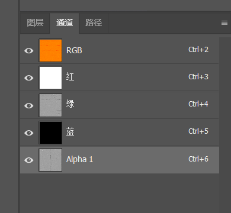

# 07. 赛道和地图类

::: tip 🛣️
官方 CSP 源码示例（[`_doc_config_tracks.ini`](https://github.com/ac-custom-shaders-patch/acc-extension-config/blob/master/_doc_config_tracks.ini)）说明了赛道 EXT 中可用 Section 及参数：
官方通用赛道材质库示例（`common/materials_track.ini`）可被 INCLUDE 引入以增强材质控制。 
:::

---

## INCLUDE 公共库引用

```ini
[INCLUDE] ; 地图 EXT 公共库引用
INCLUDE = common/conditions.ini ; 引入官方条件库
INCLUDE = common/materials_track.ini ; 引入赛道材质公共模板
INCLUDE = common/grass_fx.ini ; 引入 Grass FX 公共模板
INCLUDE = common/rain_fx.ini ; 引入 Rain FX 公共模板
```

---

## ① 赛道通用设置

::: tip 🛣️
官方文档[`Tracks – General Options`](https://github-wiki-see.page/m/ac-custom-shaders-patch/acc-extension-config/wiki/Tracks-%E2%80%93-General-options?utm_source=chatgpt.com)提供赛道通用参数，包括风效、Pitbox 数量、树木光照等；
用于控制赛道整体行为和性能优化。
:::

```ini
[BASIC]
SUPPORTS_WIND = 1                        ; 是否启用风力影响（会影响树木、旗帜动态表现）
RALLY_TRACK = 0                          ; 是否为拉力赛道（控制车辆地形交互逻辑）
PITBOXES = 6                             ; 修正 Pit Boxes 数量（覆盖默认数量）
IGNORE_OTHER_CONFIGS = 0                 ; 设置为 1 时，仅加载本 EXT 配置，不读取其他 EXT

[LIGHTING]
ENABLE_TREES_LIGHTING = 0                ; 树木是否受灯光影响（关闭可提升性能）
TRACK_AMBIENT_GROUND_MULT = 0.6          ; 地面基础环境亮度乘数，用于整体色调控制
```

---

## ② 材质发光

::: tip ✨
引用说明：[CSP 官方 \_doc_config_tracks.ini](https://github.com/ac-custom-shaders-patch/acc-extension-config/blob/master/_doc_config_tracks.ini)  
主要作用：让材质自己变亮，比如灯箱、广告牌、窗户、电子屏；性能消耗比真实光源低。
:::

### 广告牌发光

```ini
[MATERIAL_ADJUSTMENT_...] ; 广告牌夜间发光
ACTIVE = 1 ; 启用材质调整
DESCRIPTION = billboard emissive ; 写说明方便排查
MATERIALS = mat_billboard_?, mat_ad_* ; 指定广告牌材质
CONDITION = NIGHT_SMOOTH ; 夜间自动发光
KEY_0 = ksEmissive ; 调整自发光参数
VALUE_0 = 1, 1, 1, 1.5 ; 设置白色发光强度
VALUE_0_OFF = 0, 0, 0, 0 ; 白天关闭发光
```

**说明：**  
只想让广告牌亮，不需要照亮地面，就用这个，不要先上 `LIGHT_SERIES`。

---

### 建筑窗户发光

```ini
[MATERIAL_ADJUSTMENT_...] ; 建筑窗户发光
ACTIVE = 1 ; 启用材质调整
DESCRIPTION = building windows glow ; 写说明方便识别
MATERIALS = mat_window_*, glass_building_* ; 指定窗户材质
CONDITION = NIGHT_SMOOTH ; 夜晚开启
KEY_0 = ksEmissive ; 调整自发光
VALUE_0 = 1.0, 0.82, 0.55, 1.2 ; 设置暖黄色窗户光
VALUE_0_OFF = 0, 0, 0, 0 ; 白天关闭发光
KEY_1 = ksDiffuse ; 调整漫反射
VALUE_1 = 0.35 ; 夜晚降低材质亮度
VALUE_1_OFF = 1.0 ; 白天恢复默认亮度
```

**说明：**

适合楼房窗户、维修区房间、远处建筑，大量窗户不要加真实灯光，用材质发光就够。

---

### 电子屏发光

```ini
[MATERIAL_ADJUSTMENT_...] ; 电子屏发光
ACTIVE = 1 ; 启用材质调整
DESCRIPTION = track screen glow ; 写说明方便查找
MATERIALS = mat_screen_*, mat_led_* ; 指定电子屏材质
CONDITION = ALWAYS_ON ; 始终开启
KEY_0 = ksEmissive ; 调整自发光
VALUE_0 = 1, 1, 1, 2.0 ; 设置电子屏亮度
VALUE_0_OFF = 0, 0, 0, 0 ; 关闭状态发光为 0
```

**使用说明：**  
电子屏建议先用材质发光。需要照亮地面时，再补一个低强度 `LIGHT_SERIES`。

---

## ③ 真实灯光

::: tip 🔦
引用说明：[CSP 官方 ks_red_bull_ring.ini 示例](https://github.com/ac-custom-shaders-patch/acc-extension-config/blob/master/config/tracks/ks_red_bull_ring.ini)  
主要作用：给路灯、维修区灯、看台灯、隧道灯加真实照明和光锥。
:::

### 路灯灯光

```ini
[LIGHT_SERIES_...] ; 路灯真实光源
ACTIVE = 1 ; 启用灯光
MESHES = lamp_post_* ; 指定路灯 Mesh
OFFSET = 0, 5.5, 0 ; 光源从 Mesh 位置向上偏移
CLUSTER_THRESHOLD = 20 ; 多个灯之间的合并距离
COLOR = 1.0, 0.82, 0.55, 8 ; 设置暖黄色灯光和强度
COLOR_OFF = 0 ; 关闭时无光
SPOT = 140 ; 设置光锥角度
RANGE = 35 ; 设置照射范围
FADE_AT = 700 ; 距离 700 米开始淡出
FADE_SMOOTH = 100 ; 设置淡出过渡距离
RANGE_GRADIENT_OFFSET = 0.6 ; 设置光照范围渐变
SPOT_SHARPNESS = 0.5 ; 设置光锥边缘柔和度
DIRECTION = 0, -1, 0 ; 光照方向向下
CONDITION = NIGHT_SMOOTH ; 夜间开启
```

**使用说明：**  
`MESHES` 必须匹配灯具模型，灯光太吃性能时，先降低 `RANGE` 和 `CLUSTER_THRESHOLD` 数量。

---

### 维修区灯光

```ini
[LIGHT_SERIES_...] ; 维修区顶灯
ACTIVE = 1 ; 启用灯光
MESHES = pit_light_*, garage_lamp_* ; 指定维修区灯具 Mesh
OFFSET = 0, 2.5, 0 ; 光源向上偏移
CLUSTER_THRESHOLD = 8 ; 近距离灯具合并
COLOR = 1.0, 0.95, 0.85, 6 ; 设置暖白灯光
COLOR_OFF = 0 ; 关闭时无光
SPOT = 120 ; 设置照射角度
RANGE = 18 ; 设置照射范围
FADE_AT = 350 ; 远距离开始淡出
FADE_SMOOTH = 50 ; 设置淡出柔和度
DIRECTION = 0, -1, 0 ; 光照方向向下
SPECULAR_MULT = 0.4 ; 设置高光强度
DIFFUSE_CONCENTRATION = 0.5 ; 设置漫反射集中度
CONDITION = NIGHT_SMOOTH ; 夜间开启
```

---

### 隧道灯光

```ini
[LIGHT_SERIES_...] ; 隧道灯光
ACTIVE = 1 ; 启用灯光
MESHES = tunnel_lamp_* ; 指定隧道灯 Mesh
OFFSET = 0, 1.5, 0 ; 光源位置偏移
CLUSTER_THRESHOLD = 10 ; 灯具合并距离
COLOR = 1.0, 0.9, 0.75, 5 ; 设置隧道暖白光
COLOR_OFF = 0 ; 关闭时无光
SPOT = 160 ; 设置较宽光锥
RANGE = 22 ; 设置照射距离
FADE_AT = 500 ; 设置远距离淡出
FADE_SMOOTH = 80 ; 设置淡出平滑
DIRECTION = 0, -1, 0 ; 光照方向向下
CONDITION = ALWAYS_ON ; 隧道灯常亮
```

**说明：**

隧道可以常亮，不一定跟随夜间，白天进隧道也需要灯光。

---

## ④ 单点灯 LIGHT

::: tip 🛋️
引用说明：[CSP 官方 Track configs 示例目录](https://github.com/ac-custom-shaders-patch/acc-extension-config/tree/master/config/tracks)  
主要作用：给单个特殊位置加光，比如维修区入口、信号灯、广告牌前的小灯。
:::

### 单个光源

```ini
[LIGHT_...] ; 单个地图光源
ACTIVE = 1 ; 启用光源
POSITION = 10.5, 3.2, -25.0 ; 设置光源世界坐标
COLOR = 1.0, 0.85, 0.6, 5 ; 设置灯光颜色和强度
RANGE = 18 ; 设置照射范围
SPOT = 120 ; 设置光锥角度
DIRECTION = 0, -1, 0 ; 设置光照方向
FADE_AT = 300 ; 设置远距离淡出
FADE_SMOOTH = 50 ; 设置淡出过渡
CONDITION = NIGHT_SMOOTH ; 夜间开启
```

**说明：**  
单点灯适合补光，不适合大批量路灯。大批量灯优先用 `LIGHT_SERIES`。

---

## ⑤ 材质调整

### PBR材质

### NORMAL2 / AG 法线贴图
::: tip 🦹‍♂️
Normal2是CSP PBR常用的AG法线格式，不是普通紫蓝Normal。  
它把普通法线的R通道复制到Alpha，把G通道保留在Green，CSP再用A/G两通道重建法线方向。  
这样能减少DXT压缩下的法线噪点，也更符合fuPBR/txNormal2的读取方式。
:::

**从普通紫蓝法线转成 AG Normal2做法**

> 1. 用PS打开普通紫蓝Normal贴图。
> 2. 打开：窗口 > 通道。
> 3. 点“红通道”，Ctrl+A全选，Ctrl+C复制。
> 4. 新建Alpha通道。
> 5. 点Alpha通道，Ctrl+V粘贴。
> 6. 绿通道保持不动。
> 7. 点红通道，Ctrl+A，填充白色。
> 8. 点蓝通道，Ctrl+A，填充黑色或中灰。
> 9. 最终通道应为：R=白，G=原Normal绿通道，B=黑，A=原Normal红通道。
> 10. 保存DDS，格式用BC5/DXT5，关闭sRGB，保留Alpha，生成Mipmaps。



> R = 占位，一般填白
> 
> G = Normal Y方向，来自普通Normal的G通道
> 
> B = 占位，一般填黑
> 
> A = Normal X方向，来自普通Normal的R通道

**EXT里对应写法**

```ini
RESOURCE_... = txNormal2, tex/MATERIAL_txNormal2.dds ; AG法线，A存X，G存Y
```

在 `Material_PBR` 模板里：

```ini
TextureNormal = MATERIAL_txNormal2.dds, DXT5NM ; DXT5NM/AG法线，A存X，G存Y
```

如果是普通紫蓝法线，不要加 `DXT5NM`：

```ini
TextureNormal = MATERIAL_Normal.dds          ; 普通法线，R存X，G存Y
```


---

**需要引入模板：**

```ini
[INCLUDE: common/materials_track.ini]            ; 引入 CSP 官方地图材质模板
```

### 视差材质

**用于最常见的实体表面：**

> 1. 道路
> 2. 砖墙
> 3. 石头
> 4. 木板
> 5. 粗糙水泥
> 6. 沥青
> 7. 地面主材质

**表现效果：**

> - 表面有 PBR 反射；
> - 有粗糙度变化；
> - 有 AO 阴影细节；
> - 低角度观察时会产生“表面有深度”的视觉；
> - 适合做高级道路、石材、木纹。

**使用样板：**

```ini
[SHADER_REPLACEMENT_...]                         ; 新建 CSP 材质替换块，... 自动编号
ACTIVE = 1                                      ; 启用本块，0 为关闭
MATERIALS = MATERIAL_NAME                       ; 目标材质名，改成你的 KN5 材质名
SHADER = fuPBR_parallax                         ; 使用 CSP PBR + 视差 shader
BLEND_MODE = OPAQUE                             ; 不透明模式，主体实体材质优先用这个
DisplacementMax = 50                            ; 高度范围上限，用来计算高度映射
DisplacementMin = 40                            ; 高度范围下限，用来计算高度映射
PROP_... = pbrF0, 0.04                          ; 基础反射率，普通非金属推荐 0.04
PROP_... = uvScale, 1                           ; UV 缩放，1 表示使用模型原始 UV
PROP_... = pbrAlbedoGain, 1, 1, 1               ; 颜色亮度增益，1,1,1 表示不改变原图亮度
PROP_... = extParallaxScale, 0.04               ; 视差强度，道路建议 0.03~0.05
PROP_... = extParallaxSteps, 20                 ; 视差采样步数，20 比较平衡
PROP_... = extParallaxOffset, 0.5               ; 高度中线，0.5 通常最稳
PROP_... = extDisplacementRangeBase, $" $DisplacementMin / ($DisplacementMax - $DisplacementMin) " ; 高度范围自动计算，不建议改
PROP_... = extDisplacementRangeInv, $" -1 / ($DisplacementMax - $DisplacementMin) "                ; 高度范围自动计算，不建议改
PROP_... = ksEmissive, 0, 0, 0                  ; 关闭自发光
PROP_... = pbrFlags, $" 2+4 "                  ; PBR 功能位，普通道路/地面沿用 2+4
RESOURCE_... = txAlbedo, tex/MATERIAL_txAlbedo.dds             ; 颜色贴图
RESOURCE_... = txNormal2, tex/MATERIAL_txNormal2.dds           ; 法线贴图
RESOURCE_... = txEmAoMeRo, tex/MATERIAL_txEmAoMeRo.dds         ; PBR 打包贴图
RESOURCE_... = txDisplacement, tex/MATERIAL_txDisplacement.dds ; 高度贴图
```

---

### 普通 PBR 材质

**用于不需要明显高度视差的材质：**

> 1. 大理石
> 2. 抛光石材
> 3. 金属牌
> 4. 皮革
> 5. 布料
> 6. 塑料
> 7. 内饰面板
> 8. 普通墙面

**表现效果:**

> - 有 PBR 反射；
> - 有粗糙度控制；
> - 有 AO 阴影；
> - 不产生视差高度；
> - 性能比 `fuPBR_parallax` 更轻。

**使用样板：**

```ini
[SHADER_REPLACEMENT_...]                         ; 新建 CSP 材质替换块
ACTIVE = 1                                      ; 启用本块
MATERIALS = MATERIAL_NAME                       ; 目标材质名，改成你的 KN5 材质名
SHADER = fuPBR                                  ; 普通 PBR shader，不使用高度视差
BLEND_MODE = OPAQUE                             ; 不透明模式
PROP_... = pbrF0, 0.04                          ; 基础反射率，普通非金属推荐 0.04
PROP_... = uvScale, 1                           ; UV 缩放倍率
PROP_... = pbrAlbedoGain, 1, 1, 1               ; 颜色亮度增益
PROP_... = pbrRoughnessExp, 1                   ; 粗糙度曲线，1 表示不额外改变
PROP_... = ksEmissive, 0, 0, 0                  ; 关闭自发光
PROP_... = pbrFlags, $" 2+4+8 "                ; PBR 功能位，普通完整 PBR 可沿用 2+4+8
RESOURCE_... = txAlbedo, tex/MATERIAL_txAlbedo.dds     ; 颜色贴图
RESOURCE_... = txNormal2, tex/MATERIAL_txNormal2.dds   ; 法线贴图
RESOURCE_... = txEmAoMeRo, tex/MATERIAL_txEmAoMeRo.dds ; PBR 打包贴图
```

---

### 透明叠加材质

**用于覆盖在主体表面上的透明材质：**

> 1. **道路线**
> 2. **路面补丁**
> 3. **轮胎印**
> 4. **污渍**
> 5. **裂缝**
> 6. **落叶痕迹**
> 7. **边缘渐隐贴图**
> 8. **半透明贴花**

**表现效果**

> - 可以带 Alpha 透明边缘；
> - 可以叠在路面上；
> - 可做旧化、脏污、裂缝；
> - 如果使用 `fuPBR_parallax`，贴花本身也能有轻微凹凸。

**使用样板 C1：透明标线 / 普通贴花**

适合不需要高度视差的路线、贴花、标志。

```ini
[SHADER_REPLACEMENT_...]                         ; 新建 CSP 材质替换块
ACTIVE = 1                                      ; 启用本块
MATERIALS = ROAD_LINE_MATERIAL                  ; 目标材质名，例如 road_line1
SHADER = fuPBR                                  ; 普通 PBR，标线通常不需要视差
BLEND_MODE = ALPHA_BLEND                        ; Alpha 混合，适合透明边缘和远距离显示
PROP_... = pbrF0, 0.04                          ; 基础反射率
PROP_... = uvScale, 1                           ; UV 缩放倍率
PROP_... = pbrAlbedoGain, 1, 1, 1               ; 颜色亮度增益
PROP_... = pbrRoughnessExp, 1                   ; 粗糙度曲线
PROP_... = ksEmissive, 0, 0, 0                  ; 关闭自发光
PROP_... = pbrFlags, $" 2+4 "                  ; 透明路面材质常用组合
RESOURCE_... = txAlbedo, tex/ROAD_LINE_txAlbedo.dds     ; 颜色贴图，Alpha 通道控制透明
RESOURCE_... = txNormal2, tex/ROAD_LINE_txNormal2.dds   ; 法线贴图
RESOURCE_... = txEmAoMeRo, tex/ROAD_LINE_txEmAoMeRo.dds ; PBR 打包贴图
```

---

**使用样板 C2：透明补丁 / 污渍 / 裂缝 + 视差**

适合路面裂缝、修补块、厚污渍、带高度的贴花。

```ini
[SHADER_REPLACEMENT_...]                         ; 新建 CSP 材质替换块
ACTIVE = 1                                      ; 启用本块
MATERIALS = ROAD_PATCH_MATERIAL                 ; 目标材质名，例如 road_patch4
SHADER = fuPBR_parallax                         ; PBR + 视差，适合带凹凸的污渍/裂缝/补丁
BLEND_MODE = ALPHA_BLEND                        ; Alpha 混合，适合透明边缘
DisplacementMax = 50                            ; 高度范围上限
DisplacementMin = 40                            ; 高度范围下限
PROP_... = pbrF0, 0.04                          ; 基础反射率
PROP_... = uvScale, 1                           ; UV 缩放倍率
PROP_... = pbrAlbedoGain, 1, 1, 1               ; 颜色亮度增益
PROP_... = extParallaxScale, 0.03               ; 透明贴花视差不要太大，建议 0.02~0.04
PROP_... = extParallaxSteps, 16                 ; 透明材质可适当降低采样
PROP_... = extParallaxOffset, 0.5               ; 高度中线
PROP_... = extDisplacementRangeBase, $" $DisplacementMin / ($DisplacementMax - $DisplacementMin) " ; 高度范围自动计算
PROP_... = extDisplacementRangeInv, $" -1 / ($DisplacementMax - $DisplacementMin) "                ; 高度范围自动计算
PROP_... = ksEmissive, 0, 0, 0                  ; 关闭自发光
PROP_... = pbrFlags, $" 2+4 "                  ; 透明路面补丁常用组合
RESOURCE_... = txAlbedo, tex/ROAD_PATCH_txAlbedo.dds             ; 颜色贴图，Alpha 通道控制透明
RESOURCE_... = txNormal2, tex/ROAD_PATCH_txNormal2.dds           ; 法线贴图
RESOURCE_... = txEmAoMeRo, tex/ROAD_PATCH_txEmAoMeRo.dds         ; PBR 打包贴图
RESOURCE_... = txDisplacement, tex/ROAD_PATCH_txDisplacement.dds ; 高度贴图
```

---

### 原生材质视差增强

**用途**

::: tip 🦦
这个不是 `fuPBR` 主流程。  
它是 CSP 官方 `Material_DisplacementMap` 模板，用来给老的 Kunos MultiMap 材质加视差或位移。
:::

**适合：**

> 1. 老地图建筑
> 2. 原生 MultiMap 墙面
> 3. 地面材质补强
> 4. 不想完整重做 PBR 的旧材质

**表现效果：**

> - 不需要完全替换成 `fuPBR`；
> - 可以在原材质基础上增加高度感；
> - 适合旧地图快速升级；
> - Tessellation 模式性能更高，谨慎开启。

**使用样板：**

```ini
[Material_DisplacementMap]                       ; CSP 地图材质模板，用于原生 MultiMap 材质视差增强
Materials = MATERIAL_NAME                        ; 目标材质名，支持通配符，例如 buildings_lod1?
UseTessellation = 0                              ; 是否使用真实细分位移，0 更稳，1 更耗性能
UseParallaxShadows = 1                           ; 是否启用视差阴影，1 更有深度
DisplacementDistanceFar = 100                    ; 视差/位移最远计算距离
DisplacementDistanceNear = 0.5                   ; 近距离过渡，避免贴脸异常
DisplacementScale = 0.25                         ; 位移强度，数值越大越凸
DisplacementOcclusion = 0.75                     ; 位移遮蔽强度，越高凹槽越暗
TessellationFactorMin = 10                       ; 远处细分下限，只在 Tessellation 开启时明显
TessellationFactorMax = 200                      ; 近处细分上限，太高会吃性能
ParallaxEXP = 1                                  ; 高度图曲线，1 为正常
DisplacementInvert = 0                           ; 高度是否反转，黑白凹凸反了就改 1
; UseTxMapsAlpha = 1                             ; 可选：使用 txMaps Alpha 作为高度来源
```

---

###  贴图资源替换类

**用途：**

::: tip 👯‍♀️
这种不是完整材质模板，而是“二次覆盖”。
常用于某个材质前面已经设置过 shader 和参数，后面只想换贴图资源。
:::

**适合：**

> 1. road_edge 边缘透明贴图；
> 2. 同一个材质换不同贴图；
> 3. 快速覆盖 Albedo / Normal / 高度图；
> 4. 分层管理资源。

**表现效果：**

> - 不重新写完整参数；
> - 只覆盖贴图；
> - 必须放在基础 PBR 块后面；
> - 单独复制使用不完整。

**使用样板：**

```ini
[SHADER_REPLACEMENT_...]                         ; 新建二次覆盖块，必须放在基础材质块后面
ACTIVE = 1                                      ; 启用覆盖
MATERIALS = MATERIAL_NAME                       ; 目标材质名
SHADER = fuPBR_parallax                         ; 保持和前面基础材质一致，避免资源槽不匹配
BLEND_MODE = ALPHA_BLEND                        ; 如果是边缘透明贴图，用 ALPHA_BLEND
RESOURCE_... = txAlbedo, tex/MATERIAL_txAlbedoWithAlpha.dds    ; 覆盖颜色贴图，可带 Alpha
RESOURCE_... = txNormal2, tex/MATERIAL_txNormal2.dds           ; 覆盖法线贴图
RESOURCE_... = txEmAoMeRo, tex/MATERIAL_txEmAoMeRo.dds         ; 覆盖 PBR 打包贴图
RESOURCE_... = txDisplacement, tex/MATERIAL_txDisplacement.dds ; 覆盖高度贴图
```

---

### 全局 PBR 覆盖块

> **统一控制所有 `fuPBR` 和 `fuPBR_parallax` 材质的整体表现。**

**使用样板：**

```ini
[SHADER_REPLACEMENT_...]                         ; 全局 PBR 覆盖块，建议放在所有 PBR 材质后面
ACTIVE = 1                                      ; 启用本块
GainOverride = 1                                ; 全局亮度倍率，1 为不改变
MATERIALS = shader:fuPBR_parallax, shader:fuPBR ; 按 shader 类型匹配所有 PBR 材质
PROP_... = pbrAlbedoGain, $" $GainOverride, $GainOverride, $GainOverride " ; 全局 Albedo 亮度
PROP_... = pbrRoughnessExp, 1                   ; 全局粗糙度曲线，1 为默认
```

---


::: tip 🔮
控制路面、草地、边缘等视觉效果，提高真实感。
:::

```ini
[MATERIAL_ADJUSTMENT_0]
MATERIALS = track_asphalt                   ; 目标材质名称
BrightnessAdjustment = 1.1                  ; 亮度调节 (>1更亮, <1更暗)
Reflectance = 0.03                          ; 反射强度，光线反射系数
DetailScale = 2.0                            ; 纹理细节缩放，决定重复密度
CubemapReflectionBlur = 0.3                  ; 反射模糊程度，值越小越锐利
Smoothness = 0.4                             ; 光泽平滑度
HasDetailNormals = 1                          ; 启用法线贴图增强凹凸感
```

---

### Material_PBR 通用模板

::: tip 🐨
这一套是最简单的 CSP PBR 写法。  
不需要手动写 `[SHADER_REPLACEMENT_...]`，只要先引用官方模板，再写 `[Material_PBR]` 即可。
:::

```ini
[INCLUDE: common/materials_pbr.ini]             ; 引入 CSP 官方 PBR 材质模板
```

**通用样板：**

```ini
[Material_PBR]                                  ; 使用 CSP 简化 PBR 模板
Materials = pbr                          ; 目标材质名，改成 KN5 里的真实材质名
UVScale = 1                                    ; UV 缩放，1 为原始大小
F0 = 0.04                                      ; 基础反射率，普通非金属推荐 0.04
AlbedoGain = 1, 1, 1                           ; 颜色亮度，1,1,1 为不改原图
TextureAlbedo = pbr_Albedo.dds          ; 颜色图，sRGB，不建议带 AO 阴影
TextureNormal = pbr_Normal.dds          ; 法线图，Linear，控制表面凹凸
TextureEmAoMeRo = pbr_EmAoMeRo.dds      ; PBR 打包图，R发光/G AO/B金属/A粗糙度
TextureDisplacement = pbr_Displacement.dds ; 高度图，Linear，用于视差凹凸
DisplacementMax = 100                          ; 视差最远生效距离
DisplacementMin = 20                           ; 视差最近生效距离
ParallaxScale = 0.002                          ; 视差深度，越大凹凸越明显
ParallaxSteps = 62                             ; 视差采样，越高越细但更吃性能
ParallaxOffset = 0.6                           ; 高度中性值，常规灰度高度图用 0.5 左右
TextureVarianceAO = pbr_AO.dds          ; 额外 AO / 颜色变化图，可选
ApplyAOMap = 1                                 ; 启用 TextureVarianceAO 的 AO 效果
ApplyVarianceMap = 0                           ; 是否启用颜色变化，默认关闭
SpecularWorkflow = 0                           ; 0 为金属度流程，常规 PBR 推荐 0
TextureSpecular =                              ; 高光图，可选；金属度流程一般不填
BlurCubemap = 0                                ; 是否模糊环境反射，0 为不模糊
ApplyTilingFix = 1                             ; 平铺修正，减少重复纹理感
SceneryAO = 0                                  ; 场景 AO 开关，一般保持 0
SkipAlbedoForEmissive = 0                      ; 发光是否跳过 Albedo，一般保持 0
DXT5NMNormalMap = 1                            ; 法线是否按 DXT5NM 读取，普通 DDS 法线常用 1
UseUnscaledUV1For2 = 0                         ; 额外 AO 是否用原始 UV1，一般保持 0
ParallaxUVToWorld = 0                          ; 视差转世界比例，普通材质保持 0
```


#### EmAoMeRo 通道多种写法

##### 打包写法

**`EmAoMeRo` 可以拆成：**

<sheet sheet-id="FLv106" token="QqS6sohnEh7nqttNghacLCJ1nOe"></sheet>

**写法：**

```ini
TextureEmAoMeRo = tex/MATERIAL_txEmAoMeRo.dds   ; R发光 / G AO / B金属 / A粗糙度
```

>  ▲ 这表示你已经提前做好了一张通道打包图

**优点：**

> 最稳定；
> 
> 加载更快；
> 
> 不依赖 CSP 临时合成缓存；


##### 通道分开写法

> 适合测试阶段。
> 
> 当你手上只有单独的 AO、Metallic、Roughness 图，还没来得及在 PS 里打包时，可以先这样写。

**写法：**

```ini
TextureEmAoMeRo = 'color::0,0,0,0', tex/MATERIAL_AO.dds, G@tex/MATERIAL_Metallic.dds, G@tex/MATERIAL_Roughness.dds ; 临时合成 Em/AO/Metal/Rough
```

> **这行代码的意思 ▼**

```ini
'color::0,0,0,0'                  ; R 通道：自发光，0 表示没有自发光
tex/MATERIAL_AO.dds               ; G 通道：AO 图，不写前缀时默认取目标通道
G@tex/MATERIAL_Metallic.dds        ; B 通道：从 Metallic 贴图的 G 通道取值
G@tex/MATERIAL_Roughness.dds       ; A 通道：从 Roughness 贴图的 G 通道取值
```


**没有金属度图：B 通道填黑**

```ini
TextureEmAoMeRo = 'color::0,0,0,0', G@TEXTURE_AO.dds, 'color::0,0,0,1', G@TEXTURE_ROUGHNESS.dds ; 无金属材质写法
```

**没有AO：G 通道填白**

```ini
TextureEmAoMeRo = 'color::0,1,0,0', 'color::1,1,1,1', G@TEXTURE_METALLIC.dds, G@TEXTURE_ROUGHNESS.dds ; 无AO时G为白
```


**多层 PBR：TextureRAlbedoAO / TextureANmMeRo**

这是 `Material_PBR_Multilayer` 用法，不是普通 `Material_PBR`。  
每层需要两张贴图：一张放 `Albedo + AO`，另一张放 `Normal RG + Metalness + Roughness`。

```ini
TextureRAlbedoAO = RGB@rough-wet-cobble-albedo.png, G@rough-wet-cobble-ao.png ; R层：RGB颜色 + A通道AO
TextureRNmMeRo = RG@rough-wet-cobble-normal.png, G@rough-wet-cobble-metallic.png, G@rough-wet-cobble-roughness.png ; R层：RG法线/B金属/A粗糙
```

**四层完整样板**

```ini
[Material_PBR_Multilayer]
Materials = MATERIAL_NAME                   ; 目标材质
TextureAlbedo = BASE_ALBEDO.dds             ; 基础颜色
TextureMask = MASK_RGBA.dds                 ; RGBA控制四个材质层
TextureNormal = BASE_NORMAL.dds             ; 基础法线
TextureRAlbedoAO = RGB@R_ALBEDO.dds, G@R_AO.dds ; R层颜色/AO
TextureRNmMeRo = RG@R_NORMAL.dds, G@R_METALLIC.dds, G@R_ROUGHNESS.dds ; R层法线/金属/粗糙
TextureGAlbedoAO = RGB@G_ALBEDO.dds, G@G_AO.dds ; G层颜色/AO
TextureGNmMeRo = RG@G_NORMAL.dds, G@G_METALLIC.dds, G@G_ROUGHNESS.dds ; G层法线/金属/粗糙
TextureBAlbedoAO = RGB@B_ALBEDO.dds, G@B_AO.dds ; B层颜色/AO
TextureBNmMeRo = RG@B_NORMAL.dds, G@B_METALLIC.dds, G@B_ROUGHNESS.dds ; B层法线/金属/粗糙
TextureAAlbedoAO = RGB@A_ALBEDO.dds, G@A_AO.dds ; A层颜色/AO
TextureANmMeRo = RG@A_NORMAL.dds, G@A_METALLIC.dds, G@A_ROUGHNESS.dds ; A层法线/金属/粗糙
NormalizeMask = 1                           ; 规范化Mask，避免叠加过亮
```

---


### 水体着色器

```ini
[Material_Water]
Materials = water_lake                       ; 赛道水体材质名称
Type = LAKE                                  ; 水面类型（POOL / LAKE / SEA / OCEAN）
```

**参数作用**：

> -  Materials：对应 CSP Shader 识别的水面材质 
> -  Type：决定波动、反射特性，
> -  LAKE 模拟湖水效果

---

## ⑥ 条件控制

::: tip ☀️
引用说明：[CSP 官方 conditions.ini](https://github.com/ac-custom-shaders-patch/acc-extension-config/blob/master/config/tracks/common/conditions.ini)  
主要作用：控制灯光、材质、广告屏、季节效果在什么时候开启。
:::

### 夜间条件

```ini
[CONDITION_...] ; 自定义夜间条件
NAME = TRACK_NIGHT ; 设置条件名称
INPUT = NIGHT_SMOOTH ; 使用 CSP 夜间平滑输入
LUT = (|0=0|0.5=0.5|1=1|) ; 设置夜晚渐变曲线
```

**使用说明：**  
`TRACK_NIGHT` 后面可以给灯光、广告屏、材质发光调用。比直接写 `NIGHT_SMOOTH` 更方便统一管理。

---

### 夜晚 + 下雨条件

```ini
[CONDITION_...] ; 夜晚和下雨条件
NAME = NIGHT_OR_RAIN ; 设置条件名称
INPUT = 'max(NIGHT_SMOOTH, RAIN)' ; 夜晚或下雨都触发
LUT = (|0=0|1=1|) ; 输入为 1 时完全开启
```

**使用说明：**

适合路灯、维修区灯、隧道灯，白天下雨时也能开灯，画面更合理。

---

### 白天关闭夜间开启

```ini
[CONDITION_...] ; 夜间开白天关
NAME = ONLY_NIGHT ; 设置条件名称
INPUT = NIGHT_SMOOTH ; 绑定夜间平滑输入
LUT = (|0=0|0.7=0|1=1|) ; 接近夜晚才开启
```

**使用说明：**  
适合路灯、建筑灯、广告牌灯。`0.7=0` 能避免黄昏太早亮。

---

---

## ⑦ 显示 / 贴图

::: tip 🖥️
用于赛道内显示器或贴图渲染，用于计时板、摄像机画面
:::

```ini
[DISPLAY_0]
MESHES = timing_board                         ; 要渲染的模型
REGION_START = 0,0                             ; 渲染起点（左下角）
REGION_SIZE = 512,256                          ; 渲染区域尺寸
HIGH_REFRESH_RATE = 1                          ; 是否高刷新，提升动态画面流畅度
```

---

## ⑧ Rain FX 雨水效果

::: tip 🌧️
引用说明：[CSP 官方 Track configs 示例目录](https://github.com/ac-custom-shaders-patch/acc-extension-config/tree/master/config/tracks)，玩家社区 RainFX 配置教程：[Shinacmod RainFX Tutorial](https://www.shinacmod.com/assetto-corsa-rainfx-tutorial/)  
主要作用：给赛道路面、路肩、玻璃、水沟添加积水、湿润、流水、溅水效果。
:::

---

### 基础 Rain FX

```ini
[RAIN_FX] ; 地图雨水效果
PUDDLES_MATERIALS = road?, asphalt?, tarmac? ; 指定可形成水坑的路面材质
SOAKING_MATERIALS = road?, asphalt?, tarmac?, kerb? ; 指定会被雨水浸湿的材质
SMOOTH_MATERIALS = glass?, metal?, plastic? ; 指定表面较光滑的材质
ROUGH_MATERIALS = grass?, gravel?, sand? ; 指定粗糙吸水材质
LINES_MATERIALS = line?, marking?, white_line? ; 指定赛道线和标线材质
```

**使用说明：**  
`PUDDLES_MATERIALS` 控制积水，`SOAKING_MATERIALS` 控制湿润。先写路面材质，再慢慢补路肩和标线。

---

### 排水线

```ini
[RAIN_FX] ; 地图排水线设置
STREAM_EDGE_0 = -12.5, 0.02, 35.0, -10.0, 0.02, 80.0 ; 设置第 1 条路边流水线
STREAM_EDGE_1 = 8.0, 0.01, 42.0, 9.5, 0.01, 90.0 ; 设置第 2 条路边流水线
STREAM_POINT_0 = 0.0, 0.02, 15.0 ; 设置一个集中流水点
STREAM_POINT_1 = 4.5, 0.02, 30.0 ; 设置另一个集中流水点
```

**使用说明：**  
`STREAM_EDGE` 适合路边排水；`STREAM_POINT` 适合低洼点、排水口、水沟入口。

---

### 禁止某些材质积水

```ini
[RAIN_FX] ; 雨水材质排除
PUDDLES_MATERIALS = road?, asphalt? ; 只让路面形成水坑
SOAKING_MATERIALS = road?, asphalt?, kerb? ; 让路面和路肩湿润
ROUGH_MATERIALS = grass?, gravel?, sand?, wall? ; 草地砂石墙面不形成水坑
```

**使用说明：**  
墙面、草地、砂石不要乱加 `PUDDLES_MATERIALS`，否则会出现不自然的大面积水面。

---

## ⑨ Grass FX 草地效果

::: tip 🌱
引用说明：[CSP 官方 Track configs 示例目录](https://github.com/ac-custom-shaders-patch/acc-extension-config/tree/master/config/tracks)，玩家社区写法参考：[Assetto Corsa Mods Grass FX 讨论](https://assettocorsamods.net/threads/how-to-enable-grass-fx-on-my-track.1890/)  
主要作用：给赛道周围生成 3D 草、野花、草丛，提升路边细节。
:::

### 基础 Grass FX

```ini
[GRASS_FX] ; 地图草地效果
GRASS_MATERIALS = grass?, terrain_grass?, land? ; 指定生成草的材质
OCCLUDING_MATERIALS = road?, asphalt?, kerb?, wall? ; 指定不允许穿草的遮挡材质
ORIGINAL_GRASS_MATERIALS = grass?, terrain_grass? ; 指定原始草地材质
MASK_MAIN_THRESHOLD = 0.5 ; 设置主遮罩阈值
MASK_RED_THRESHOLD = 0.3 ; 设置红色通道阈值
MASK_MIN_LUMINANCE = 0.02 ; 设置最低亮度阈值
MASK_MAX_LUMINANCE = 1.0 ; 设置最高亮度阈值
SHAPE_SIZE = 1.2 ; 设置草的整体大小
SHAPE_TIDY = 0.2 ; 设置草的整齐度
SHAPE_CUT = 0.0 ; 设置草被修剪程度
TEXTURE = grass_fx/highlands.dds ; 指定草地纹理
TEXTURE_GRID = 8, 3 ; 设置草纹理网格
```

**使用说明：**  
先只写 `GRASS_MATERIALS`，确认草能出来后，再加遮挡和纹理参数。

---

### 低性能草地样板

```ini
[GRASS_FX] ; 低性能消耗草地
GRASS_MATERIALS = grass?, terrain? ; 指定草地材质
OCCLUDING_MATERIALS = road?, kerb?, wall? ; 指定遮挡材质
SHAPE_SIZE = 0.8 ; 降低草大小
SHAPE_TIDY = 0.5 ; 提高整齐度
SHAPE_CUT = 0.3 ; 设置草更短
TEXTURE = grass_fx/highlands.dds ; 指定草地纹理
TEXTURE_GRID = 8, 3 ; 设置纹理网格
```

**使用说明：**

远景草太密会掉帧。先减少草尺寸，再检查生成材质是否过多。

---

## ⑩ 树木/植被

```ini
[TREESET_0]
MODEL = tree_oak                          ; 树木模型
POSITION_LIST = trees_positions.csv       ; 树木位置 CSV 列表
```

---


## ⑪ Extra FX 修复

::: tip 🦜
引用说明：[Ereebay Wiki：通用 – Extra FX 标志](https://github.com/Ereebay/acc-extension-config/wiki/%E9%80%9A%E7%94%A8-%E2%80%93-Extra-FX-%E6%A0%87%E5%BF%97)  
主要作用：修复透明贴花、玻璃、电子屏、运动物体、Grass FX、水面前后层级等问题。
:::

### 地图电子屏修复

```ini
[EXTRA_FX] ; 地图电子屏 Extra FX 修复
DELAYED_RENDER = mesh_track_screen_* ; 延迟渲染电子屏内容
GLASS_FILTER = mesh_track_screen_glass_* ; 修复屏幕玻璃拖影
MOVING_FILTER = mesh_track_screen_anim_* ; 修复动态屏幕拖影
AUTOFIX = 1 ; 启用自动修复
```

**说明：**  
适合赛道大屏、维修区电子屏、LED 屏幕。屏幕拖影优先加 `GLASS_FILTER`。

---

### 透明贴花修复

```ini
[EXTRA_FX] ; 透明贴花层级修复
SKIP_GBUFFER = mesh_decal_transparent_* ; 透明贴花跳过 G-buffer
BLEND_GBUFFER = mesh_banner_transparent_* ; 风挡或横幅类透明层混合
MASK_GBUFFER = mesh_glass_fence_* ; 玻璃围栏遮罩
AUTOFIX = 1 ; 启用自动修复
```

**说明：**

适合透明广告、玻璃围栏、铁丝网贴图、半透明横幅。

---

### Grass FX 前后层级修复

```ini
[EXTRA_FX] ; Grass FX 层级修复
FORCE_GRASSFX_GBUFFER_PASS = 1 ; 强制 Grass FX 进入 G-buffer pass
AUTOFIX = 1 ; 启用自动修复
```

**说明：**

草地在水面、反射表面、透明贴花前显示异常时可以加。

---

## ⑫ 赛道模型替换

::: tip 🎭
引用说明：[CSP 官方 General – Model replacements](https://github.com/ac-custom-shaders-patch/acc-extension-config/wiki/General-%E2%80%93-Model-replacements)  
主要作用：在不改原始 KN5 的情况下，隐藏、插入、替换地图模型。
:::

### 隐藏地图物件

```ini
[MODEL_REPLACEMENT_...] ; 隐藏地图物件
ACTIVE = 1 ; 启用模型替换
FILE = track.kn5 ; 指定地图 KN5 文件
HIDE = old_banner_01, old_sign_02 ; 隐藏旧广告牌或标志
```

**使用说明：**  
适合隐藏旧广告、错误路牌、重复物件，`FILE` 要写地图实际 KN5 文件名。

---

### 插入新模型

```ini
[MODEL_REPLACEMENT_...] ; 插入地图附加模型
ACTIVE = 1 ; 启用模型插入
FILE = track.kn5 ; 指定地图 KN5 文件
INSERT = extension/models/new_billboard.kn5 ; 插入新的广告牌模型
INSERT_AFTER = banners_root ; 插入到指定节点后面
SCALE = 1, 1, 1 ; 设置模型缩放
ROTATION = 0, 0, 0 ; 设置模型旋转
OFFSET = 0, 0, 0 ; 设置模型位移
```

---

### 替换旧模型

```ini
[MODEL_REPLACEMENT_...] ; 替换旧地图物件
ACTIVE = 1 ; 启用替换
FILE = track.kn5 ; 指定地图 KN5 文件
HIDE = old_bridge_banner ; 隐藏旧桥牌
INSERT = extension/models/new_bridge_banner.kn5 ; 插入新桥牌模型
INSERT_AFTER = bridge_root ; 插入到桥梁节点后
SCALE = 1, 1, 1 ; 保持原尺寸
ROTATION = 0, 0, 0 ; 不旋转
OFFSET = 0, 0, 0 ; 不偏移
```

---

## ⑬ 地图动画

::: tip 🐜
引用说明：[CSP 官方 Cars – Animations](https://github.com/ac-custom-shaders-patch/acc-extension-config/wiki/Cars-%E2%80%93-Animations)，地图项目也常用同类动画逻辑。  
主要作用：控制地图道闸、电子门、旗帜、风扇、广告牌等动态物件。
:::

### 时间控制动画

```ini
[ANIMATION_...] ; 地图时间动画
INPUT = TIME_HOURS ; 绑定当前小时
INPUT_MIN = 0 ; 设置最小时间
INPUT_MAX = 24 ; 设置最大时间
INPUT_LUT = (|0=0|12=1|24=0|) ; 按时间控制动画进度
FILE = animation/track_object.ksanim ; 指定地图动画文件
TIME = 5.0 ; 设置动画总时长
INPUT_AS_PROGRESS = 1 ; 使用时间直接控制动画进度
LOOP_WHILE_ACTIVE = 0 ; 不循环播放
LOOP_KEEP_UNTIL_DONE = 0 ; 不强制播完
```

**使用说明：**

适合昼夜变化物件，比如遮阳棚、灯牌、动态广告。

---

### 常循环动画

```ini
[ANIMATION_...] ; 地图循环动画
INPUT = 1 ; 始终激活动画
FILE = animation/fan_loop.ksanim ; 指定循环动画文件
TIME = 2.0 ; 设置单次循环时间
LOOP_WHILE_ACTIVE = 1 ; 激活时循环播放
LOOP_KEEP_UNTIL_DONE = 0 ; 不强制播完
```

**使用说明：**

适合风扇、旋转招牌、远景机械件。

---

## ⑭ 地图音源控制

::: tip 📣
引用说明：[CSP 官方 acc-extension-config Track configs](https://github.com/ac-custom-shaders-patch/acc-extension-config/tree/master/config/tracks)  
主要作用：给地图添加固定位置声音，比如广播、观众声、维修区环境声。
:::

### 固定环境声

```ini
[AUDIO_SOURCE_...] ; 地图固定音源
ACTIVE = 1 ; 启用音源
POSITION = 15.0, 2.0, -35.0 ; 设置音源世界坐标
SOUND = extension/sfx/pit_ambience.wav ; 指定声音文件
VOLUME = 1.0 ; 设置音量
PITCH = 1.0 ; 设置音高
RANGE = 80 ; 设置可听范围
LOOP = 1 ; 循环播放声音
CONDITION = ALWAYS_ON ; 始终播放
```

**使用说明：**

适合维修区、观众席、广播声。

---

### 夜间广播声

```ini
[AUDIO_SOURCE_...] ; 夜间广播音源
ACTIVE = 1 ; 启用音源
POSITION = -20.0, 4.0, 60.0 ; 设置音源坐标
SOUND = extension/sfx/night_ambience.wav ; 指定夜间环境声
VOLUME = 0.7 ; 设置音量
PITCH = 1.0 ; 设置音高
RANGE = 120 ; 设置声音范围
LOOP = 1 ; 循环播放
CONDITION = NIGHT_SMOOTH ; 夜晚播放
```

---

## ⑮ 季节与冬季材质

::: tip ❄️
引用说明：[CSP 官方 ks_nordschleife.ini 示例](https://github.com/ac-custom-shaders-patch/acc-extension-config/blob/master/config/tracks/ks_nordschleife.ini)  
主要作用：根据季节改变树叶、草地、路边材质透明度、颜色或亮度。
:::

### 冬季树叶隐藏

```ini
[MATERIAL_ADJUSTMENT_...] ; 冬季树叶透明
ACTIVE = 1 ; 启用材质调整
DESCRIPTION = winter tree alpha ; 写说明方便排查
MATERIALS = branch?, Branches?, tree_shadow ; 指定树叶和树影材质
CONDITION = SEASON_WINTER ; 冬季条件触发
KEY_0 = alpha ; 调整透明度
VALUE_0 = 0 ; 冬季隐藏树叶
VALUE_0_OFF = 1 ; 非冬季恢复显示
KEY_1 = ksAlphaRef ; 调整透明裁切阈值
VALUE_1 = 1 ; 冬季提高裁切
VALUE_1_OFF = 0.5 ; 非冬季恢复裁切
```

---

### 冬季草地变淡

```ini
[MATERIAL_ADJUSTMENT_...] ; 冬季草地变淡
ACTIVE = 1 ; 启用材质调整
DESCRIPTION = winter grass color ; 写说明方便识别
MATERIALS = grass?, terrain_grass? ; 指定草地材质
CONDITION = SEASON_WINTER ; 冬季触发
KEY_0 = ksDiffuse ; 调整漫反射
VALUE_0 = 0.65 ; 冬季降低草地颜色强度
VALUE_0_OFF = 1.0 ; 非冬季恢复正常
KEY_1 = ksAmbient ; 调整环境光
VALUE_1 = 0.45 ; 冬季降低环境光
VALUE_1_OFF = 1.0 ; 非冬季恢复环境光
```

---

## ⑯ 赛道摄像机 / 观众区辅助发光

::: tip 📹
引用说明：[CSP 官方 Track configs 示例目录](https://github.com/ac-custom-shaders-patch/acc-extension-config/tree/master/config/tracks)  
主要作用：给观众区、摄影机位、维修区小物件增加夜间可见度。
:::

### 观众区弱发光

```ini
[MATERIAL_ADJUSTMENT_...] ; 观众区夜间弱发光
ACTIVE = 1 ; 启用材质调整
DESCRIPTION = crowd night visibility ; 写说明方便排查
MATERIALS = crowd?, spectator?, people? ; 指定观众材质
CONDITION = NIGHT_SMOOTH ; 夜间触发
KEY_0 = ksAmbient ; 提高夜间环境亮度
VALUE_0 = 0.35 ; 设置夜间观众亮度
VALUE_0_OFF = 1.0 ; 白天恢复默认
```

---

## 杂项配置

```ini
[SPECTATORS]
FLASH_INTENSITY = 1.0                    ; 观众闪光灯强度

[SHADER_REPLACEMENT_0]
MATERIALS = distant_geometry              ; 远景几何材质
SHADER = ksPerPixel_horizon               ; 替换 Shader 用于远景优化
```

---

---